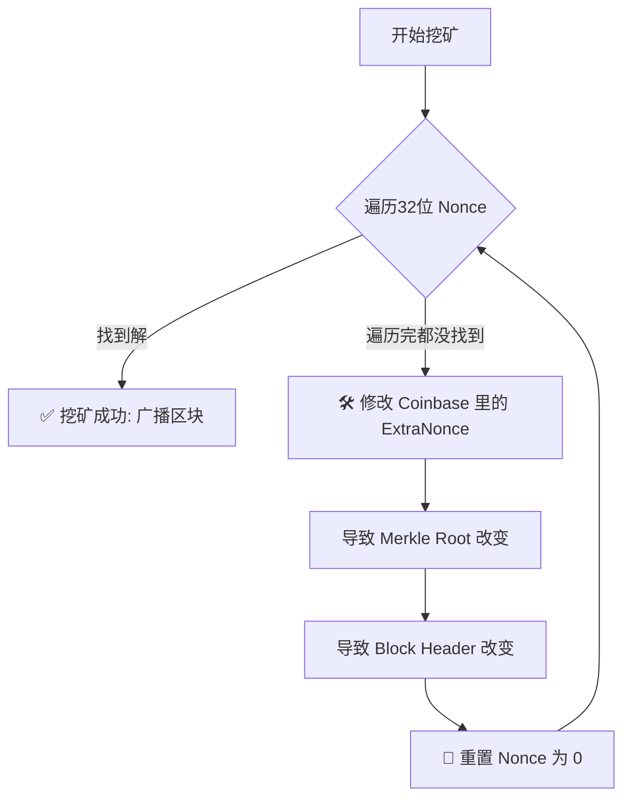
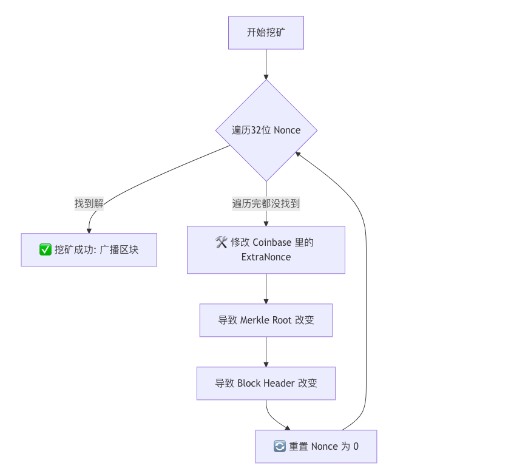

北京大学肖臻老师《区块链技术与应用》公开课第 11 讲实际上是**“问答环节”**（Q&A）。在这一讲中，肖老师集中回答了学生们关于前几节课（共识协议、挖矿、分叉等）提出的各种核心疑问。

这些问题非常具有代表性，往往也是初学者最容易混淆的地方。以下是基于该课程内容的结构化详细总结：

### 一、 转账与交易相关问题

#### 1. 转账时收款人不在线怎么办？

* **回答**：没关系，完全不影响。
* **原理**：比特币交易只是向区块链网络“广播”一笔交易，并没有直接发给收款人。只要全网矿工把这笔交易打包进区块，转账就成功了。收款人什么时候上线，只是为了查看自己有没有收到钱，不影响转账本身的发生。

#### 2. 假如全节点收到一笔交易，发现转账金额 > 余额怎么办？

* **回答**：直接丢弃，不予转发。
* **原理**：全节点在内存中维护了 **UTXO**（未花费交易输出）集合。收到交易时，它会立刻查 UTXO，如果发现余额不足，或者这笔钱已经被花过了（双花），验证失败，节点会直接忽略这笔交易，不会将其传播给邻居。

---

### 二、 挖矿与区块相关问题

#### 3. 为什么不把区块的 Nonce 设得大一点？（例如 64位、128位）

* **背景**：现在挖矿难度很高，32 位的 Nonce 空间太小（ 亿），矿工遍历完所有 Nonce 都找不到解的情况很常见。
* **回答**：只改 Nonce 没用，因为改协议结构需要硬分叉。
* **实际做法**：矿工遍历完 Nonce 还没找到解时，会去修改 **Coinbase 交易**中的 **Extra Nonce**（输入域）。
* 修改 Coinbase 域  Merkle Root 改变  区块头哈希改变  相当于重置了整个搜索空间  可以重新遍历一遍 32 位的 Nonce。

#### 4. 只有算力最强的矿工才能挖到块吗？

* **回答**：不是。
* **原理**：挖矿是概率事件（伯努利试验）。算力强只是代表概率大，就像买彩票，买得越多中奖概率越大，但买得少的人也有可能中奖。

#### 5. 假如两个矿工同时挖到块，怎么处理？

* **回答**：产生临时分叉。
* **流程**：
1. 网络中出现两个等长的合法链分支。
2. 每个全节点根据“先听到谁就认谁”的原则，暂时选择一条链。
3. 等到下一个区块被挖出，由于算力竞争，其中一条链会变得更长。
4. 全网切换到“最长合法链”，另一条链上的区块成为**孤块（Orphan Block）**，被抛弃。

---

### 三、 安全与攻击相关问题

#### 6. 51% 攻击能做什么？不能做什么？

这是非常关键的一个纠正点。

* **能做的事**：
* **双花（Double Spending）**：攻击者可以把自己花出去的钱，通过重写历史（制造更长的链）再拿回来。
* **分叉/拒绝服务**：故意让区块链分叉，或者拒绝打包某些人的交易。

* **不能做的事**：
* **凭空造币**：不能修改 Coinbase 奖励金额（会被全节点校验）。
* **盗窃他人的币**：无法伪造他人的数字签名，所以不能把别人的钱转给自己。

#### 7. 私钥丢失了怎么办？能找回吗？

* **回答**：绝对找不回，钱永久锁死在区块链上。
* **解释**：比特币没有“忘记密码”功能，没有中心化机构客服。

#### 8. 量子计算机会威胁比特币安全吗？

* **回答**：现在的量子计算机还远未达到破解 SHA-256 或椭圆曲线加密的水平。如果未来真的出现这种危机，比特币协议也可以进行**软分叉**升级（例如换用抗量子加密算法），虽然旧地址的钱可能不安全，但新系统可以存活。

---

### 四、 协议与手续费问题

#### 9. 既然交易手续费给矿工，为什么还要给区块奖励？

* **回答**：这是为了早期激励和货币发行。
* **演变**：早期交易少，手续费不够吸引矿工，必须靠出块奖励（Coinbase Reward）发行新币来吸引算力。随着每 4 年减半，未来奖励越来越少，手续费将成为矿工的主要收入来源。

#### 10. 为什么比特币出块时间定为 10 分钟？

* **回答**：这是一个折衷（Trade-off）。
* **太短**（如几秒）：分叉会极度频繁，导致网络不稳定，大量算力浪费在孤块上。
* **太长**（如几小时）：交易确认太慢，用户体验差。
* 10 分钟是中本聪认为在“网络传播延迟”与“用户体验”之间的一个平衡点。

---

### 💡 核心逻辑图解：矿工如何应对 Nonce 空间不足

针对第 3 个问题（Nonce 不够用），这是挖矿实操中最重要的逻辑，我为你整理成流程图：

