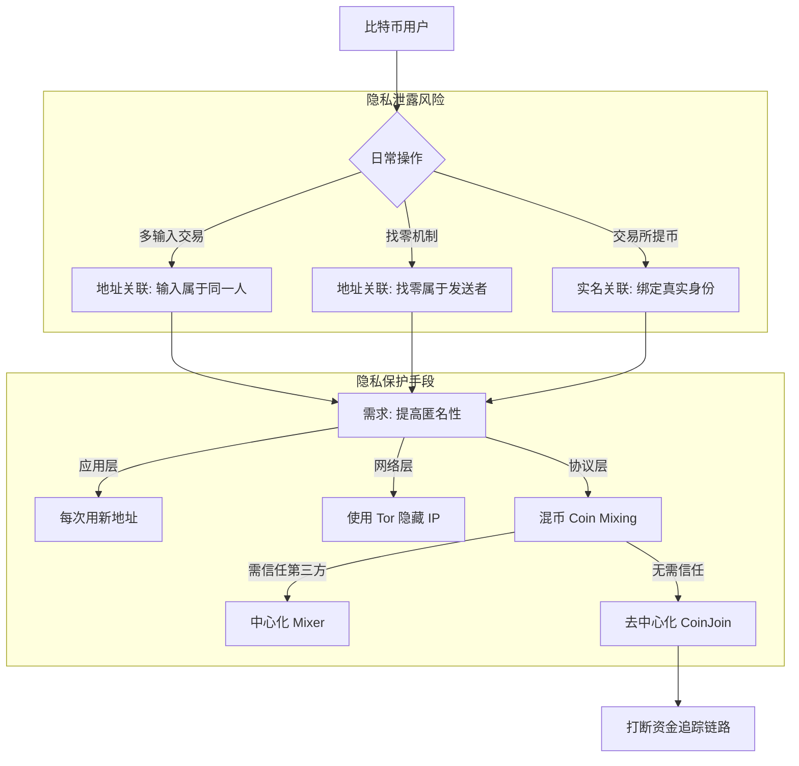
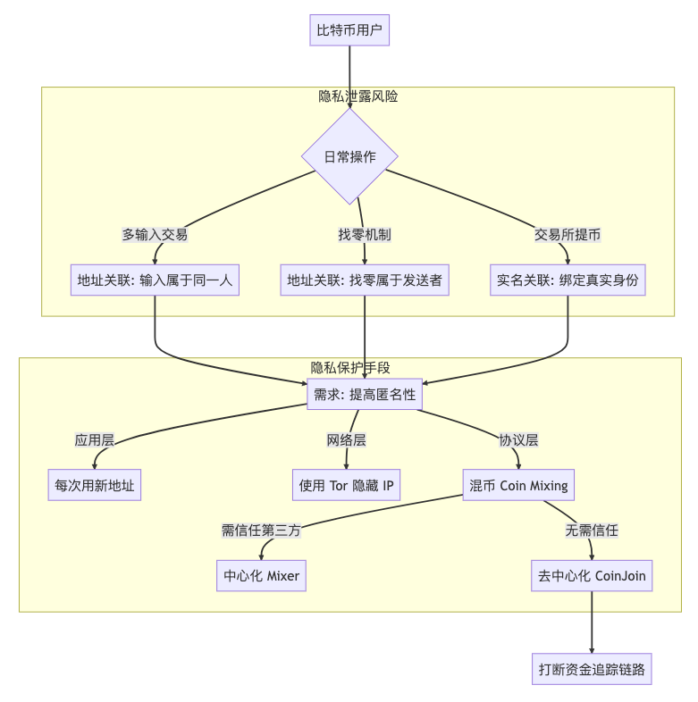
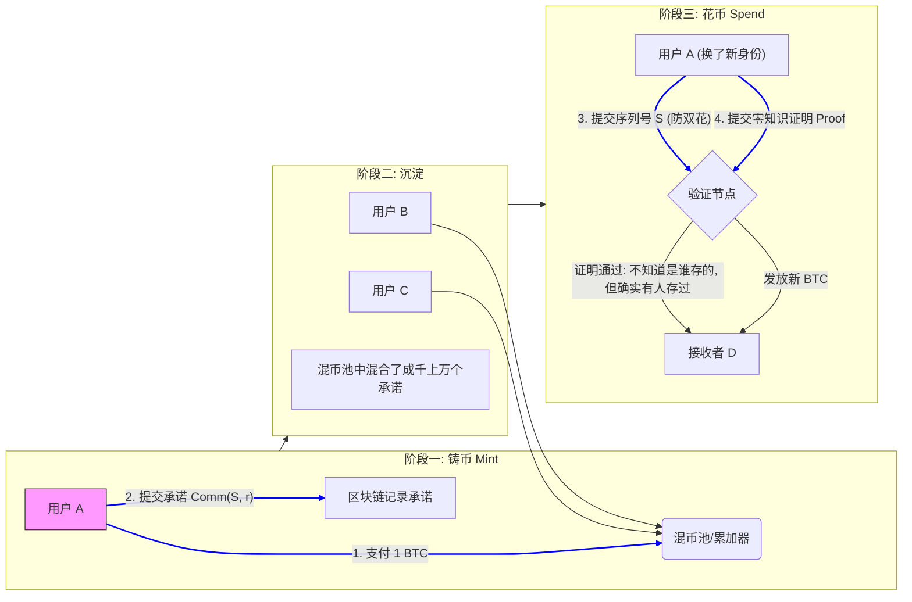
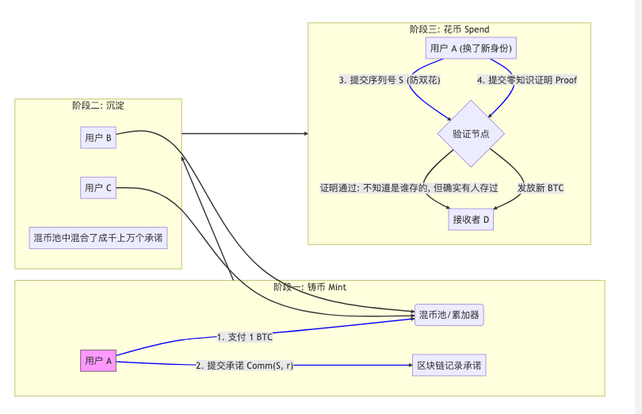

北京大学肖臻老师《区块链技术与应用》公开课第 12 讲的主题是**“比特币的匿名性” (Anonymity)**。

这节课不仅澄清了大众对“比特币完全匿名”的误解，还详细介绍了如何通过技术手段“破坏”这种匿名性（去匿名化），以及反过来如何“保护”隐私（混币等技术）。

以下是本课内容的**结构化详细总结**：

### 一、 核心观点：比特币不是真名，但也不是真的匿名

肖老师开篇强调：比特币的匿名性实际上是**化名 (Pseudonymity)**。

* **化名性**：比特币地址是公钥哈希，确实没有写着你的真实姓名（User Real Name）。
* **公开性**：所有交易记录、转账金额、资金流向在区块链上完全公开，任何人可查。
* **关联性**：一旦某个地址与你的真实身份挂钩（例如你在交易所实名认证后提币），通过区块链上的交易图谱分析，你所有的资金流向可能都会被曝光。

### 二、 破坏匿名性：如何进行“去匿名化”分析？

如果不使用特殊手段，比特币的隐私保护其实非常脆弱。分析者通常利用以下两种**启发式规则 (Heuristics)** 来聚类（Clustering）属于同一个人的地址：

#### 1. 多输入合并规则 (Multi-Input Heuristic)

* **现象**：如果你发起一笔交易，使用了多个输入（Input 1, Input 2...）来凑够金额。
* **推论**：这些输入地址（Address A, Address B）大概率**属于同一个人**。
* **后果**：分析者可以将这些离散的地址关联起来，归为一个实体。

#### 2. 找零地址规则 (Change Address Heuristic)

* **现象**：A 转账给 B。交易输出通常有两个：一个是给 B 的 5 BTC，另一个是找零给自己的 2 BTC。
* **推论**：如果是简单的钱包软件，通常会生成一个新的找零地址。但通过分析金额特征（比如 5 BTC 是整数，2.134 BTC 是找零），可以判断出哪个是找零地址。
* **后果**：分析者可以知道找零地址和发送方属于同一个人，从而追踪后续资金。

#### 3. 实体关联 (Real World Linkage)

* **交易所/钱包 KYC**：这是最直接的去匿名化入口。你在交易所实名注册，交易所知道该地址属于你。
* **OTC 交易**：线下买卖币也容易暴露身份。

---

### 三、 保护匿名性：如何提高隐私？

针对上述漏洞，课程介绍了几种提高匿名性的手段，从简单到复杂。

#### 1. 应用层：最基本的保护

* **生成新地址**：每次收款都使用一个新的地址（现代钱包自动完成）。这能一定程度上防止别人通过一个地址查遍你所有家底，但无法防住多输入合并分析。

#### 2. 网络层：隐藏 IP

* **洋葱路由 (Tor)**：比特币节点在转发消息时并不加密，容易被监听 IP。使用 Tor 可以切断 IP 地址与比特币地址的关联。

#### 3. 核心技术：混币 (Coin Mixing)

这是本节课的重头戏，目的是打断“输入”与“输出”之间的连线。

* **中心化混币 (Centralized Mixing)**
* **原理**：大家把币都转给第三方（Mixer），Mixer 把钱打乱后，再分别转给每个人指定的新地址。
* **缺点**：你需要信任 Mixer。Mixer 可能会卷款跑路（Rogue），或者泄露你的隐私记录。

* **去中心化混币 (CoinJoin)**
* **原理**：多个用户联合起来发起一笔**多输入、多输出**的巨大交易。
* **特点**：
* 交易结构上，输入有 A, B, C，输出有 A', B', C'。
* 从外界看，不知道 A 的钱去了 A' 还是 B'。
* **关键点**：不需要把钱交给第三方托管，只要大家对这笔交易进行签名即可（Signed independently）。

### 四、 进阶概念：零知识证明与 ZCash

课程最后简要提及了比 Bitcoin 匿名性更强的方案。

* **零知识证明 (Zero-Knowledge Proof)**：一方（证明者）向另一方（验证者）证明一个陈述是真实的，而不需要透露除了“该陈述是真实的”之外的任何信息。
* **ZCash (大零币)**：真正实现了加密货币的匿名性，连转账金额和交易双方都可以隐藏。它利用零知识证明来验证交易合法性，而无需公开交易细节。

---

### 💡 逻辑流程总结 (Flowchart)

为了让你理清“去匿名化”与“保护隐私”的对抗逻辑，我为你整理了如下流程图：

### 🧠 核心名词解释

* **Pseudonymity**：化名。就像作家的笔名，虽然不是身份证名字，但笔名下的所有作品都能关联到一起。
* **Unlinkability**：不可关联性。这是隐私保护追求的目标，即无法证明两个交易或两个地址属于同一个人。
* **CoinJoin**：一种具体的混币协议，允许多个用户合并输入和输出，使得外界无法区分资金的具体流向。

这节课的核心启示是：**在区块链这个公开账本上，隐私不是天赋的，而是需要主动通过技术手段（如混币）去争取的。**

关于**加密货币匿名性技术演进**的 **零币 (ZeroCoin)** 和 **零钞 (ZeroCash)**。这部分是肖臻老师讲解“如何通过数学手段彻底解决隐私问题”的精华。

以下是针对这两个知识点的详细补全总结：

---

### 一、 背景：从“混币”到“零知识证明”

前面的 CoinJoin（混币）虽然能切断关联，但它有局限性：你需要找到其他人跟你一起混币，而且还得在线配合。

为了实现**无需他人配合、随时随地**的匿名，学术界提出了基于**零知识证明 (Zero-Knowledge Proof)** 的方案。

* **零知识证明核心**：证明者（Prover）能够在不向验证者（Verifier）透露具体数据（如私钥、具体是哪一枚币）的情况下，证明自己拥有该数据或操作是合法的。

---

### 二、 零币协议 (ZeroCoin)

ZeroCoin 是早期的一个协议提案（后来也有独立币种），它的核心思想是：**通过密码学手段，把“铸币”和“花币”的过程彻底切断关联。**

#### 1. 运作机制：基础币与零币的转换

ZeroCoin 系统中存在两种币：**基础币 (Base Coin，如 BTC)** 和 **零币 (ZeroCoin)**。

* **铸币 (Mint)**：
* **操作**：用户销毁（支付）一个单位的基础币，换取一张“零币”的凭证。
* **数学过程**：用户生成一个随机数 （序列号）和 （随机秘密），计算承诺 ，并将  发布到区块链上。
* **本质**：这就像你往一个巨大的“混币池”里扔了一枚硬币，换回一张**匿名兑换券**。

* **花币 (Spend)**：
* **操作**：用户使用那张凭证，兑换回一个新的基础币（通常是转给别人）。
* **关键点**：用户不需要告诉矿工“我兑换的是刚才哪一次 Mint 的币”（否则就暴露了）。
* **零知识证明的应用**：用户只需提交一个数学证明，证明“我知道某个 ，它对应链上已经存在的某个承诺 ，但我不会告诉你是哪一个”。同时公布序列号  防止双重支付。
* **结果**：旧的 Base Coin  ZeroCoin  新的 Base Coin。输入和输出的链路在数学上被切断了。

#### 2. ZeroCoin 的缺点

* **效率低**：生成的证明（Proof）非常大，验证速度慢，导致区块膨胀严重，交易处理很慢。
* **功能受限**：只能隐藏“发送方”和“接收方”的关联，但**转账金额**是固定的（通常由不同面额的零币组成），无法隐藏金额。

---

### 三、 零钞协议 (ZeroCash)

ZeroCash 是 ZeroCoin 的改良版，也就是后来著名的加密货币 **Zcash (大零币)** 的底层协议。

#### 1. 核心改进：zk-SNARKs

ZeroCash 使用了一种更高级的零知识证明技术，称为 **zk-SNARKs** (Zero-Knowledge Succinct Non-Interactive Argument of Knowledge，零知识简洁非交互式知识论证)。

* **Succinct (简洁)**：这是最大的突破。生成的证明非常小（只有几百字节），验证速度极快（毫秒级）。
* **彻底的匿名**：不仅隐藏了发送方和接收方，还隐藏了**转账金额**。

#### 2. 运作机制

在 ZeroCash 中，交易不再像比特币那样明文显示“A 转给 B 多少钱”，而是全都加密了。

* 矿工验证时，不需要解密交易内容，而是验证 zk-SNARKs 证明。
* 证明内容大致为：“我消耗了某些旧的币（不透露是哪些），生成了新的币（不透露金额），且输入金额等于输出金额。”

#### 3. 争议点：可信设置 (Trusted Setup)

ZeroCash 有一个著名的安全隐患。

* **初始化问题**：zk-SNARKs 需要一个初始的公共参数（Public Parameters）。这个参数生成时会产生一些“有毒废料”（Toxic Waste，即私密的随机数）。
* **风险**：如果生成参数的人没有销毁这些“有毒废料”，拥有这些数据的人就可以**凭空伪造 Zcash**（无限印钞），而且没人能发现（因为金额是隐藏的）。
* **对策**：Zcash 在启动时举行了极其复杂的“多方计算仪式”，确保只要有一个参与者销毁了私钥，系统就是安全的。

---

### 四、 总结对比表：比特币 vs 零币 vs 零钞

为了让你一目了然，我整理了这个对比表：

| 特性 | Bitcoin (比特币) | ZeroCoin (零币) | ZeroCash (零钞/Zcash) |
| --- | --- | --- | --- |
| **匿名性级别** | **伪匿名** (Pseudonymity) | **强匿名** (链路切断) | **完全匿名** (链路+金额隐藏) |
| **核心技术** | 无 (公开账本) | 基础零知识证明 | **zk-SNARKs** |
| **证明大小** | N/A | 大 (效率低) | **极小** (效率高) |
| **金额是否可见** | **可见** | 可见 (固定面额) | **隐藏** |
| **交易验证速度** | 快 | 慢 | 快 |
| **初始化风险** | 无 | 无 | **有 (Trusted Setup)** |

---

### 🧠 逻辑流程图：零币的洗白过程

为了直观理解 ZeroCoin 如何通过“铸币”和“花币”来切断追踪，请看下图：

**核心逻辑**：当你把水（1 BTC）倒入大海（混币池），再从大海里舀出一杯水（1 BTC），没人知道这杯水是不是你当初倒进去的那杯，物理联系被数学概率切断了。
