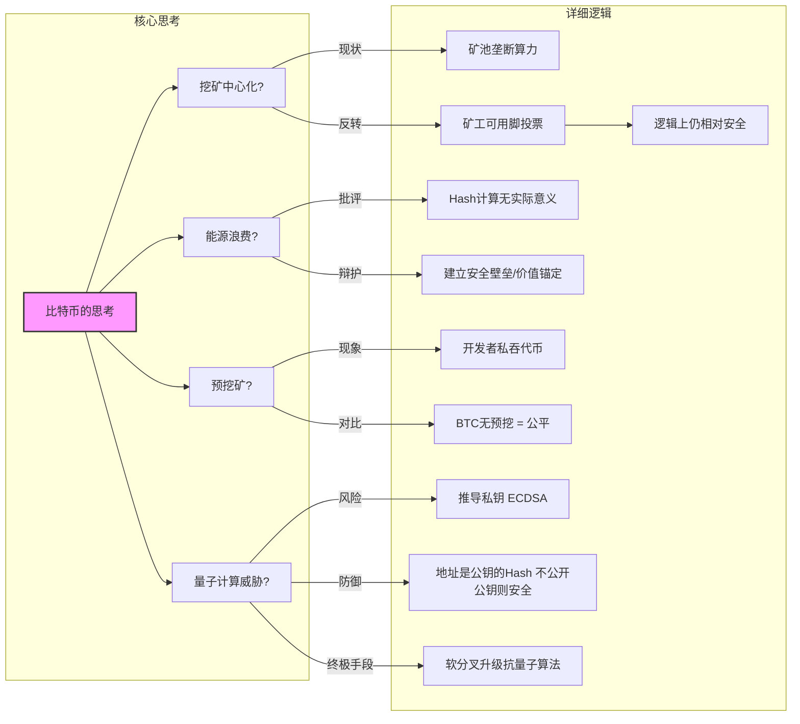
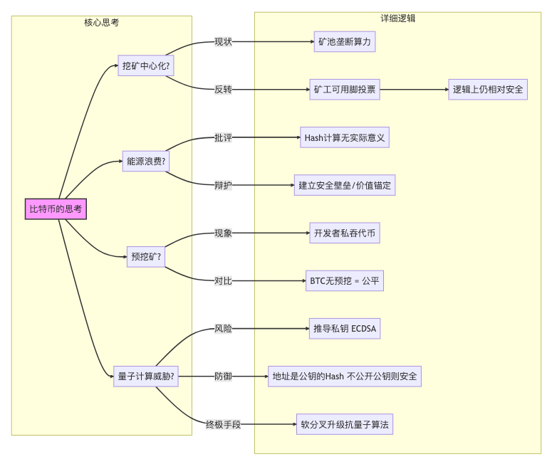

北京大学肖臻老师《区块链技术与应用》公开课第 13 讲的主题是**“比特币引发的思考” (Reflections on Bitcoin)**。

在结束了比特币具体技术细节（共识、分叉、匿名性等）的讲解后，这一讲从更宏观的角度探讨了比特币系统在实际运行中引发的争议、局限性以及未来的挑战。

以下是本课内容的**结构化详细总结**：

### 一、 哈希算力的中心化 (Centralization of Mining)

虽然比特币的愿景是去中心化（One CPU, One Vote），但现实中挖矿算力高度集中。

1. **现状**：
* **矿池 (Mining Pools)** 的出现改变了格局。前几大矿池的算力总和往往超过了 全网的 50%。
* 如果几个大矿池联手，理论上可以轻易发动 **51% 攻击**。

2. **为什么没有被攻击？**
* **利益捆绑**：矿池拥有大量比特币算力，攻击比特币会摧毁整个系统的信用，导致比特币价格崩盘，矿池自己的设备和算力也会变得一文不值。
* **矿工的制约**：矿池并不拥有矿机，它只是管理者。如果矿池作恶（例如试图回滚交易），个体矿工会撤出算力加入其他矿池。这种**“用脚投票”**的机制限制了矿池管理者的权力。

3. **结论**：虽然算力在**物理上**集中在几个矿池节点，但由于利益博弈，系统在**逻辑上**依然保持了相对的去中心化和安全性。

### 二、 能源消耗问题 (Energy Consumption)

比特币的 PoW（工作量证明）共识机制消耗了巨大的电力，引发了广泛批评。

1. **浪费的本质**：
* 挖矿的计算过程（寻找 Nonce）除了维护账本安全外，**没有其他实际用途**。
* 这种能源消耗被认为是“无谓的浪费”。

2. **辩护观点**：
* **价值锚定**：任何货币系统都需要成本。黄金挖掘需要物理成本，法币维护（银行系统、印钞、安保）也消耗能源。比特币的能源消耗通过“电力”将虚拟货币与物理世界挂钩，增加了伪造的成本。
* **安全性代价**：巨大的能源消耗构建了极高的算力壁垒，使得外人无法轻易攻击这个账本。

3. **现状**：虽然争议不断，但目前没有完美的替代方案能达到同样的去中心化和安全程度（虽然以太坊后来转向了 PoS）。

### 三、 预挖矿 (Pre-mining) 与公平性

1. **预挖矿定义**：在加密货币公开向大众发行之前，开发者或创始团队预先为自己“保留”一部分货币。
2. **比特币的公平性**：
* **中本聪 (Satoshi Nakamoto)** 没有进行预挖矿。
* 虽然他挖出了早期的很多区块（据估计约 100 万枚），但在当时任何人都可以加入挖矿，规则是公开透明的。这被认为是**最公平**的发行方式。

3. **Altcoins (山寨币) 的乱象**：
* 很多后来的山寨币项目，开发者会预留大量货币（Pre-mining），这就带来了**“割韭菜” (Pump and Dump)** 的风险：开发者在币价上涨后抛售套现，导致币价归零。
* 判断一个项目是否靠谱，**“有没有预挖矿”**、**“开发者持有比例”** 是重要的参考指标。

### 四、 比特币与量子计算 (Quantum Computing)

学生们非常关心：量子计算机会不会破解比特币？

1. **威胁点**：
* 量子计算机擅长分解大质数和计算离散对数，这直接威胁比特币使用的 **椭圆曲线加密算法 (ECDSA)**。
* 这意味着：如果你有了量子计算机，理论上可以从公钥推导出私钥。

2. **缓解因素**：
* **哈希函数安全**：比特币挖矿和地址生成使用了 SHA-256 和 RIPEMD-160。量子计算机目前对**哈希函数**的破解优势不大（仅能通过 Grover 算法将难度减半，通过增加位数即可抵御）。
* **地址保护**：比特币地址是公钥的**哈希**。如果你从未使用过这个地址（即没有发出过交易），你的公钥并未在网络上公开。攻击者无法从“地址”（哈希值）反推出公钥，也就无法利用量子算法推导私钥。
* **危险窗口**：当你发起交易时，必须公开公钥。从“交易广播”到“交易打包”这段时间，公钥是暴露的，量子计算机有机会在这几分钟内推算出私钥并进行攻击（但这要求极高的计算速度）。

3. **解决方案**：
* **软分叉升级**：如果量子计算机真的实用化了，比特币可以通过软分叉升级加密算法（例如换成抗量子签名的 Lamport 签名）。
* 虽然旧地址的钱可能不安全（如果公钥已经暴露），但新系统可以存活。

### 🧠 核心逻辑思维导图 (Bitcoin Reflections)

### 💡 总结

* **核心结论**：比特币并不完美，它在去中心化程度、效率、安全性上做出了特定的权衡（Trade-off）。虽然面临矿池中心化和量子计算的潜在威胁，但其博弈机制和可升级性使其具有强大的生命力。