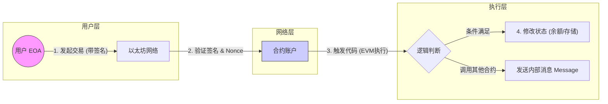
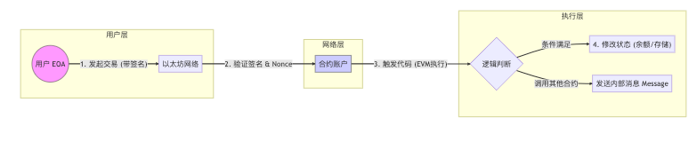

北京大学肖臻老师《区块链技术与应用》公开课第 14 讲是**以太坊 (Ethereum)** 的开篇，主题通常是**“以太坊概述” (Introduction to Ethereum)**。

在告别了比特币章节后，课程正式进入“区块链 2.0”时代。这一讲主要介绍了以太坊的设计理念、与比特币的区别以及核心账户模型。

以下是本课内容的**结构化详细总结**：

### 一、 以太坊的定位：区块链 2.0

1. **从去中心化货币到去中心化合约**：
* **比特币 (Bitcoin)**：主要目标是做一个去中心化的加密货币（Payment Network），被称为“全球账本”。
* **以太坊 (Ethereum)**：主要目标是做一个去中心化的**智能合约平台 (Smart Contract Platform)**，被称为“世界计算机”。

2. **可编程性**：
* 比特币的脚本语言（Script）非常简单，功能有限（非图灵完备），很难开发复杂的应用。
* 以太坊提供了一种**图灵完备 (Turing Complete)** 的编程语言（Solidity），允许开发者在区块链上编写任意复杂的逻辑（智能合约）。

### 二、 以太坊的账户模型 (Account-based Model)

这是以太坊与比特币最底层的区别。

#### 1. 比特币：UTXO 模型

* **特点**：没有“账户余额”的概念，你的钱是一堆“未花费的交易输出” (UTXO) 拼凑出来的。
* **缺点**：难以精确控制“状态”。比如你想写一个合约限制“每天只能取 10 块钱”，在 UTXO 模型下很难实现，因为你需要追溯并管理大量零散的 UTXO。

#### 2. 以太坊：基于账户的模型

* **特点**：系统直接记录每个账户的**余额 (Balance)**、**计数器 (Nonce)** 等状态。这就好比银行账户，想转账直接扣款即可。
* **优点**：
* **直观**：符合人们对“账户”的直觉理解。
* **易于编程**：智能合约本质上就是管理状态（State），账户模型天生适合状态管理。
* **防重放攻击**：显式地使用 Nonce（交易计数器）来防止同一笔交易被广播两次。

### 三、 两类账户 (Two Types of Accounts)

在以太坊中，账户分为两类，它们在数据结构上是统一的，但功能不同。

#### 1. 外部账户 (Externally Owned Account, EOA)

* **控制者**：由**私钥**控制（即普通用户使用的账户）。
* **特点**：
* 有余额 (Balance)。
* 有 Nonce (交易序号)。
* **没有代码** (No Code)。
* **主动发起交易**：只有 EOA 才能发起交易（Transaction），这是区块链一切活动的源头。

#### 2. 合约账户 (Contract Account)

* **控制者**：由**代码**逻辑控制（没有私钥对应）。
* **特点**：
* 有余额。
* 有 Nonce。
* **有代码** (Code)：存储了智能合约的编译后字节码。
* **有存储** (Storage)：维护了一棵存储树（Storage Trie），保存合约运行时的状态变量（如投票数、众筹金额等）。

* **被动执行**：合约账户不能自己发起交易，必须被 EOA 或其他合约调用（发送消息）才能触发其代码执行。

### 四、 交易与消息 (Transaction & Message)

* **交易 (Transaction)**：
* 指的是从 **外部账户 (EOA)** 发出的签名数据包。
* 包含：接收方地址、金额、Nonce、签名、以及可选的数据（Data，用于调用合约函数）。

* **消息 (Message / Internal Transaction)**：
* 指的是**合约调用合约**时产生的数据传递。
* 它不直接记录在区块链上，而是作为交易执行过程中的一部分。

### 五、 以太坊的数据结构概览

肖老师在这一讲中也简要铺垫了以太坊复杂的状态树结构（下一讲会深入）：

* **状态树 (State Trie)**：记录全网所有账户的状态（余额、Nonce、代码哈希、存储根）。
* **特点**：使用 MPT (Merkle Patricia Trie) 结构，既能像 Merkle Tree 一样验证数据完整性，又能高效地进行查找和更新。

---

### 🧠 逻辑流程：以太坊的运行机制

### 💡 总结

第 14 讲的核心任务是**“转换思维”**：
从比特币的 **“UTXO + 脚本”** 思维，转换到以太坊的 **“账户 + 状态 + 智能合约”** 思维。这是理解后续去中心化应用 (DApp) 的基石。