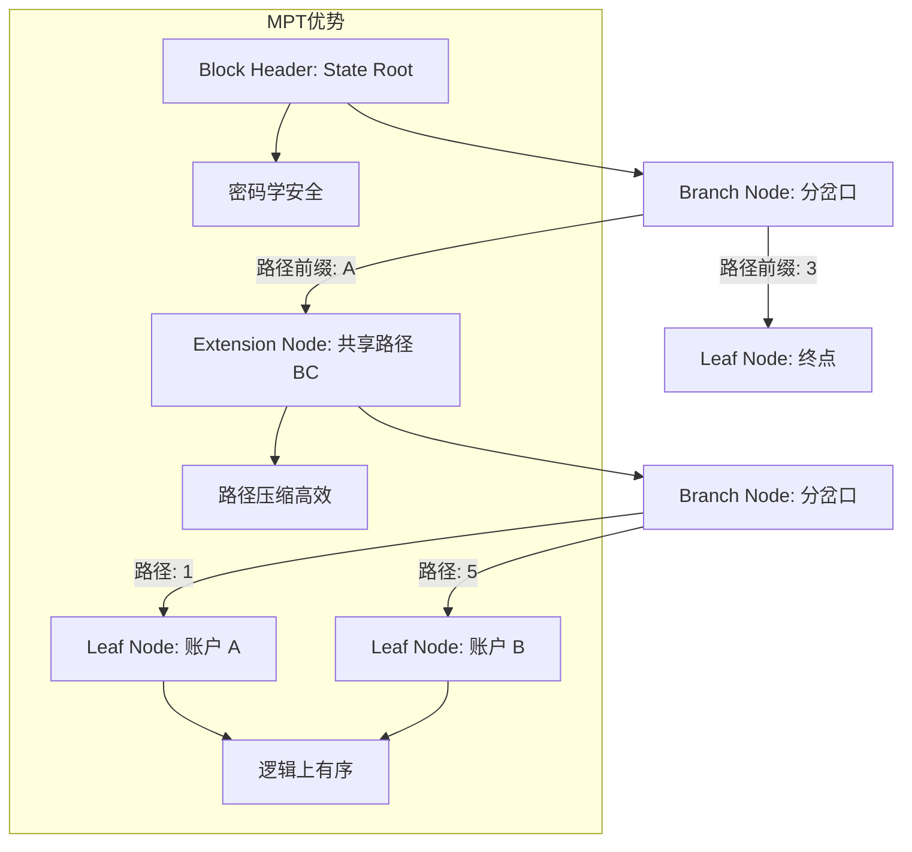
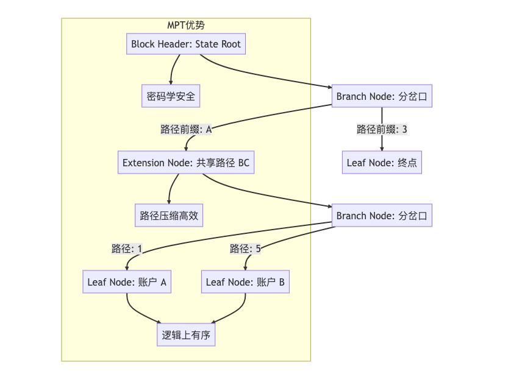

北京大学肖臻老师《区块链技术与应用》公开课第 15 讲的主题是**“以太坊的状态树” (The State Tree)**。

这一讲深入到了以太坊的底层数据结构，解释了以太坊是如何在区块头中存储“全网状态”的。这节课是理解以太坊“世界计算机”本质的关键，因为它解决了**“如何高效存储和验证海量账户状态”**的难题。

以下是本课内容的**结构化详细总结**：

### 一、 核心问题：如何存储状态？

在上一讲中我们知道，以太坊采用**账户模型 (Account-based)**，系统需要维护一个巨大的映射（Mapping）：

> **Addr  State (Balance, Nonce, CodeHash, StorageRoot)**

我们需要一种数据结构来存储这个映射，并满足以下苛刻要求：

1. **高效查找与更新**：状态随着每个区块都在变化，必须能快速修改。
2. **Merkle Proof 支持**：轻节点需要能验证某个账户的余额，而不需要下载全网状态。
3. **持久化与历史溯源**：需要能回滚到任意一个历史区块的状态。

### 二、 方案演进推导 (Evolution of Data Structures)

肖老师按照“提出方案 -> 发现问题 -> 改进方案”的逻辑进行了推导：

#### 1. 哈希表 (Hash Table)

* **思路**：直接用哈希表存状态。
* **缺陷**：虽然查找快，但在构建 Merkle Proof 时非常困难。如果把所有账户哈希成一个根，每次修改一个账户都要重新计算整个哈希树，效率极低。

#### 2. 直观的 Merkle Tree

* **思路**：将所有账户数据排序后，构建一个标准的 Merkle Tree。
* **缺陷**：
* **插入代价大**：如果有新账户创建，插入到数组中间会导致后面的数据全部移动，整棵树大部分都要重构。
* **非确定性**：如果没有严格排序，包含相同数据的树可能有不同的 Root Hash。

#### 3. Trie (前缀树/字典树)

* **思路**：使用账户地址（Address）作为路径，一位一位地向下查找。
* **优点**：
* **局部更新**：修改一个账户，只影响该分支的哈希值，不影响其他分支。
* **有序性**：无论插入顺序如何，只要数据集合相同，构建出的 Trie 结构是唯一的（Determinism）。

* **缺陷**：
* **效率低**：以太坊地址是 160 位（40 个 16 进制字符），会导致树的高度非常高（40 层）。
* **稀疏**：绝大多数路径是空的，浪费存储空间。

#### 4. Patricia Trie (压缩前缀树)

* **改进**：如果某个节点只有一条路径（比如 "app" 下面只有 "apple"），就将路径**压缩**合并。
* **效果**：降低了树的高度，提高了效率。

### 三、 终极方案：Merkle Patricia Trie (MPT)

以太坊最终采用的是 **MPT**，结合了 Merkle Tree 的加密验证功能和 Patricia Trie 的路径压缩功能。

#### 1. 三种节点类型

为了实现压缩和分支，MPT 设计了三种特殊的节点结构：

* **Leaf Node (叶子节点)**：
* 表示路径的终点。
* 包含：`[剩余路径, 账户值]`。

* **Extension Node (扩展节点)**：
* 用于路径压缩（就像高速公路）。
* 包含：`[共享路径, 下一个节点的哈希]`。

* **Branch Node (分支节点)**：
* 用于分岔（就像十字路口）。
* 包含：`[0-F (16个分支), Value]`。因为以太坊使用 16 进制，所以每个节点最多有 16 个孩子。

#### 2. 状态存储逻辑

* **Key**：账户地址的哈希值（Sha3(Address)）。为什么不直接用 Address？为了防止黑客构造特定地址让树变得极度不平衡（DoS 攻击）。
* **Value**：账户状态的 RLP 编码（Balance, Nonce...）。
* **数据库**：虽然逻辑上是一棵树，但物理上这些节点都是以 `Key-Value` 对的形式存储在 LevelDB 中的。

### 四、 状态树的特性 (Properties)

#### 1. 根哈希 (Root Hash)

每个区块头里包含一个 `Root` 字段。这个 Root 是**当前时刻**全网所有账户状态构建出的 MPT 的根哈希。

* **防篡改**：只要状态有一丝变化，Root 就会彻底改变。
* **轻节点验证**：轻节点只存 Block Header，可以通过向全节点请求 Merkle path 来验证某个账户的余额。

#### 2. 状态共享 (Data Sharing)

* **问题**：每个区块都生成一个新的 MPT，数据量会不会爆炸？
* **机制**：**不会**。因为大部分账户在两个相邻区块之间是**不发生变化**的。
* 新区块的 MPT 只是新建了那些“发生变化”的节点分支，未变化的部分直接**指向**前一个区块的旧节点。这使得以太坊的状态历史像一个“增量文件系统”。

### 五、 代码树与存储树 (Code & Storage Trie)

除了全局的**状态树 (State Trie)**，每个账户内部还有两个重要的属性：

* **CodeHash**：如果账户是合约，代码本身是只读的。代码被存储在数据库中，账户里只存代码的哈希。
* **StorageRoot**：如果合约里有变量（比如 `mapping (address => uint) balance`），这些变量会构成另一棵 MPT，称为**存储树 (Storage Trie)**。这个树的根哈希保存在账户状态里。

---

### 🧠 核心逻辑图解 (MPT 结构)

为了让你直观理解 MPT 如何运作，请看下图：

### 💡 总结

第 15 讲的核心在于理解 **MPT (Merkle Patricia Trie)**。
它是以太坊的“脊梁”，完美平衡了**效率**（查找快）、**安全**（可验证）和**存储成本**（数据共享）。所有的交易执行、状态变更，最终都体现为这就这棵巨大的 MPT 树上的节点更新。