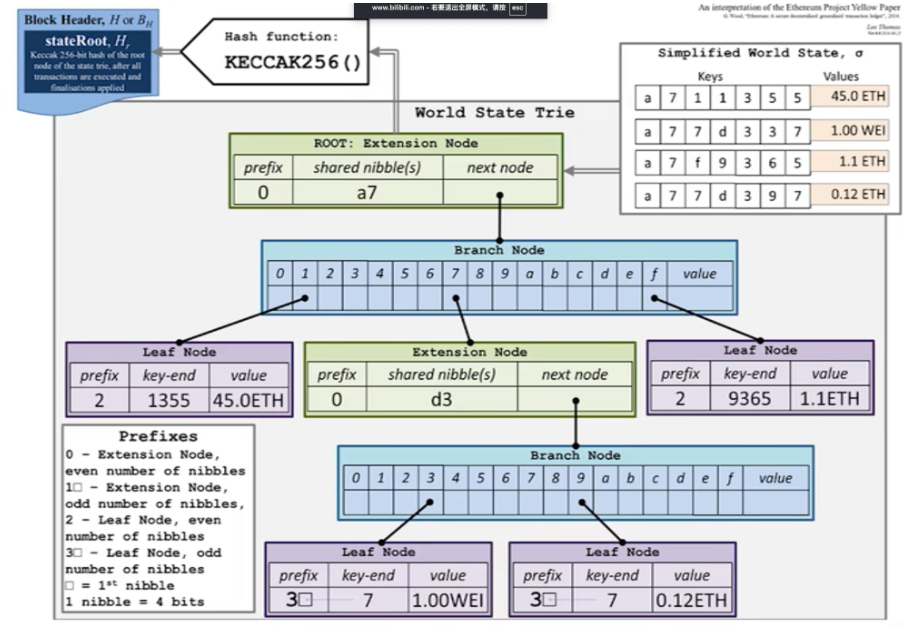
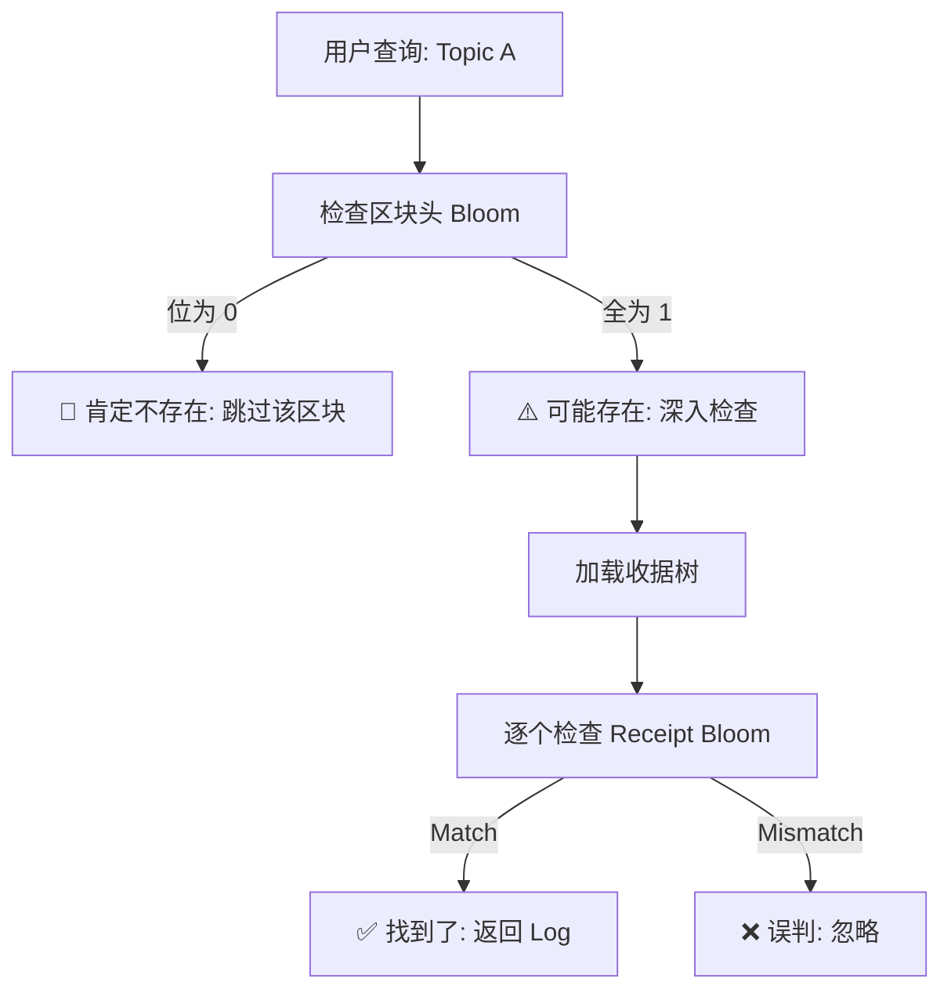
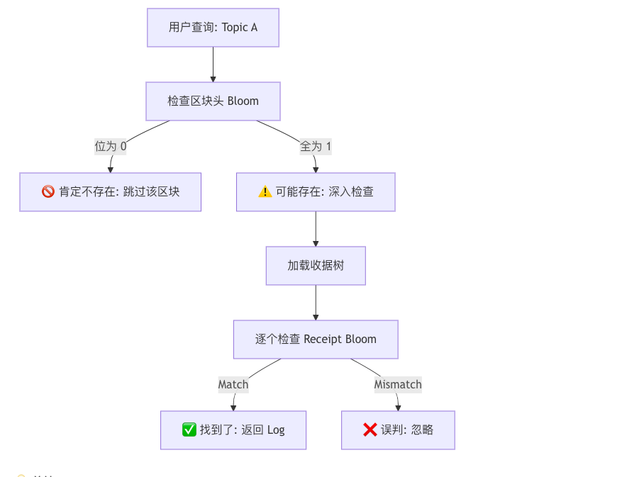

北京大学肖臻老师《区块链技术与应用》公开课第 16、17 讲的主题是\*\*“以太坊的数据结构（下）：MPT 的代码实现与布隆过滤器”\*\*。

在上一讲介绍了 MPT（Merkle Patricia Trie）的理论基础后，这一讲深入到了具体的**代码实现细节**，以及以太坊如何通过**布隆过滤器 (Bloom Filter)** 来高效查询交易回执。

以下是本课内容的**结构化详细总结**：

### 一、 MPT 的代码实现细节 (Modified MPT)

以太坊在实际代码中对标准的 MPT 进行了修改和优化，使其更适合在 Key-Value 数据库（如 LevelDB）中存储。

#### 1. 节点的结构定义

在代码中，节点并不是直接存为“对象”，而是存为**数组**。

*   **分支节点 (Branch Node)**：长度为 17 的数组。

*   前 16 个元素对应 0-F 的十六进制分支。

*   第 17 个元素是 Value（存储数据，仅在 Key 结束于该节点时有值）。

*   **叶子节点 (Leaf Node)**：长度为 2 的数组。

*   `[Path, Value]`。

*   **扩展节点 (Extension Node)**：长度为 2 的数组。

*   `[Path, NextNodeKey]`。

#### 2. 路径编码：Hex Prefix Encoding (HP 编码)

这是本节课的难点。由于叶子节点和扩展节点的结构都是“长度为 2 的数组”，程序如何区分它们？又是如何表示路径的奇偶长度？以太坊设计了 **HP 编码**。

*   **目的**：

1.  区分节点类型（Leaf vs Extension）。
2.  解决路径长度为奇数时的字节对齐问题（一字节存两个 16 进制数，奇数个没法存）。

*   **规则**：在路径前面加一个**前缀字节 (Prefix Byte)**。

*   **Prefix 的高 4 位**：用于标记节点类型和奇偶性。

*   `0` (0000): 扩展节点，路径长度为偶数。

*   `1` (0001): 扩展节点，路径长度为奇数。

*   `2` (0010): 叶子节点，路径长度为偶数。

*   `3` (0011): 叶子节点，路径长度为奇数。

*   **Prefix 的低 4 位**：

*   如果路径长度是偶数，低 4 位为 `0`（padding）。

*   如果路径长度是奇数，低 4 位存放路径的**第一个半字节 (Nibble)**。

*   **举例**：

*   扩展节点，路径 `1A 2B` (偶数)：Prefix 是 `00`  存为 `00 1A 2B`。

*   叶子节点，路径 `3C` (奇数)：Prefix 是 `3`，把 `3` 放到低 4 位  存为 `33 C` (实际存储字节为 `3C`，这里为了利用半字节空间)。

#### 3. 数据库存储映射

*   **内存中**：MPT 是一个树状的对象结构，节点之间通过指针（引用）相连。

*   **持久化**：写入 LevelDB 时，所有节点都被**序列化 (RLP 编码)**。

*   Key = 节点的哈希值。

*   Value = 节点内容的 RLP 编码。

*   **哈希指针**：在数据库中，节点之间不再是指针，而是**哈希值**。例如扩展节点的 `NextNodeKey` 存的是下一个节点的哈希，想访问下一个节点时，用这个哈希去数据库查。

***

### 二、 区块头中的三棵树 (The Three Tries)

区块头不仅包含状态树的根，还包含另外两棵树的根，它们都采用 MPT 结构：

1.  **状态树 (State Trie)**：

*   Key: 账户地址哈希。
*   Value: 账户状态 (Balance, Nonce...)。
*   **特点**：全网共享，跨区块增量更新。

2.  **交易树 (Transaction Trie)**：

*   Key: 交易在区块内的序号 (RLP 编码)。
*   Value: 交易内容的 RLP 编码。
*   **特点**：**不共享**。每个区块有独立的交易树，因为历史区块的交易是固定的。

3.  **收据树 (Receipt Trie)**：

*   Key: 交易序号。
*   Value: 交易执行后的收据 (Receipt)。
*   **作用**：记录交易执行结果（成功/失败）、消耗的 Gas、以及智能合约产生的 **Log (日志)**。

***

### 三、 布隆过滤器 (Bloom Filter)

这是本节课的另一个核心。以太坊需要支持高效的**日志查询**（例如：“查询过去 10 天所有涉及‘Hello’事件的交易”）。遍历几百万个区块的收据树太慢了，所以引入了布隆过滤器。

#### 1. 什么是布隆过滤器？

*   **原理**：使用一个大的位数组 (Bit Array) 和 k 个哈希函数。

*   **插入**：将元素通过 k 个哈希函数映射到位数组的 k 个位置，把这些位置置为 `1`。

*   **查询**：

*   如果查出的 k 个位置**全都是 1**  元素**可能存在** (Maybe)。

*   如果只要有一个位置**是 0**  元素**一定不存在** (No)。

*   **特点**：不支持删除，有误判率（False Positive），但绝无漏判（False Negative）。

#### 2. 在以太坊中的应用

*   **Log Bloom**：

*   每个**收据 (Receipt)** 都有一个 Bloom Filter，记录了该交易产生的所有 Log 事件（如转账地址、事件 Topic）。

*   **Block Header Bloom**：

*   每个**区块头**也有一个 Bloom Filter。

*   它是该区块内**所有交易收据 Bloom Filter 的并集 (OR 操作)**。

*   **查询流程**：

*   查找某个 Topic 时，轻节点先看**区块头**的 Bloom Filter。

*   如果区块头说“没有”，那就肯定没有，直接跳过整个区块（极快）。

*   如果区块头说“可能有”，再进一步去加载区块内的收据树进行精确查找。

***

### 🧠 核心逻辑图解：查询优化

### 💡 总结

第 16 讲完成了数据结构的拼图：

1.  **MPT 代码实现**：通过 **Hex Prefix 编码** 解决了奇偶路径和节点类型标记问题，实现了紧凑存储。
2.  **三棵树**：状态树、交易树、收据树共同构成了以太坊的数据层。
3.  **布隆过滤器**：作为一种\*\*“快速排除”\*\*机制，极大提高了轻节点在海量历史数据中检索特定事件（Log）的效率。
