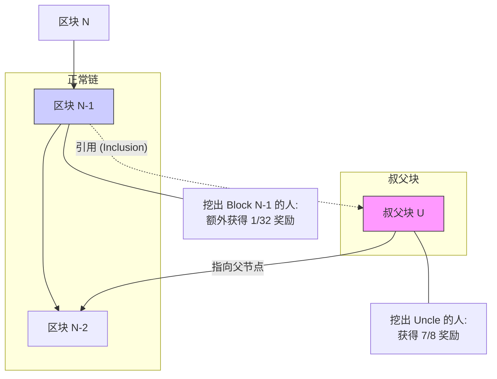
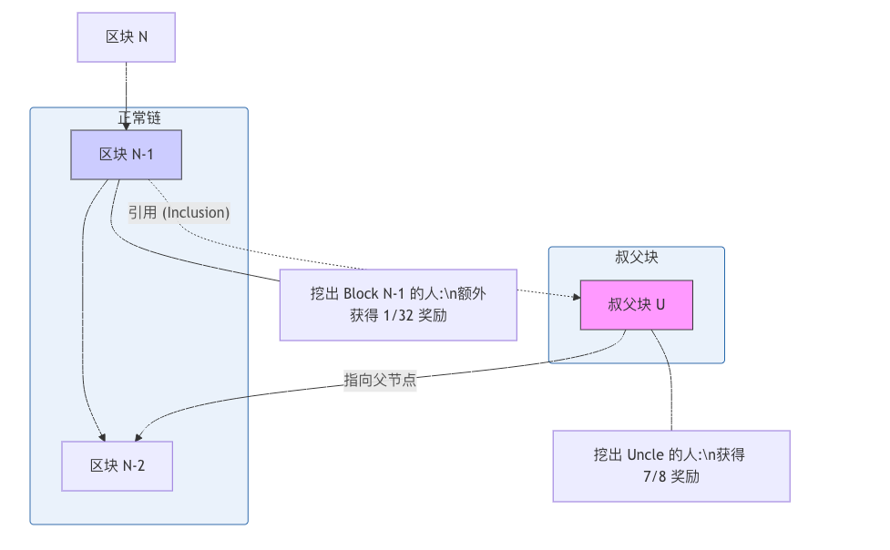

北京大学肖臻老师《区块链技术与应用》公开课第 17 讲的主题是**“以太坊的 GHOST 协议”**。

在比特币中，废弃的区块被称为“孤块”且没有任何奖励；而在以太坊中，由于出块速度快，为了安全性与公平性，引入了 GHOST 协议及其变种，将这些废弃区块称为**“叔父块” (Uncle Block)** 并给予奖励。

以下是本课内容的**结构化详细总结**：

### 一、 引入 GHOST 协议的背景

1. **出块时间差异**：
* 比特币：平均 10 分钟出一个块。
* 以太坊：平均 15 秒出一个块。

2. **带来的问题**：
* **高分叉率 (High Stale Rate)**：出块太快，导致区块还在网络传播时，别的矿工可能已经挖出了另一个块。这会导致大量的“孤块”产生。
* **安全性降低**：如果大量算力浪费在孤块上，真正维护主链安全的算力比例就会下降，攻击者更容易发动 51% 攻击。
* **中心化风险**：大型矿池拥有更好的网络连接，能更快接收和广播区块，产生孤块的概率低；而个体矿工很容易挖出孤块（白干）。久而久之，个体矿工会不得不加入大矿池，导致算力集中。

### 二、 GHOST 协议的核心思想

* **全称**：Greedy Heaviest Observed Subtree (贪婪最重观察子树)。
* **原版 GHOST 逻辑**：
* 在比特币的“最长链原则”中，只看哪条链最长。
* GHOST 提出，应该选择**“包含工作量最多”**的那条路径。也就是说，在判断哪条链是主链时，不仅要看主链上的区块，还要把该链产生的“分叉区块”（孤块/叔块）的算力也加进去计算权重。
* **好处**：即使有人攻击主链，但他很难伪造出大量的“叔块”来增加自己链的权重。

### 三、 以太坊中的 GHOST 实现 (Modified GHOST)

以太坊并没有完全照搬原始的 GHOST 协议（即主链选择依然主要依赖最长链逻辑），而是**借鉴了其精神**，引入了**叔父块 (Uncle Block)** 机制并给予奖励。

#### 1. 什么是叔父块？

* 如果一个矿工挖出的区块是合法的，但因为网络延迟等原因没有成为主链区块（被其他人抢先了），这个区块在比特币里是“废块”，但在以太坊里可以被下一个主链区块“收留”，成为**叔父块**。
* **定义**：当前区块的**祖父节点**的**直接子节点**（即父亲的兄弟）。

#### 2. 叔父块的规则

* **收留限制**：一个主链区块最多只能包含 **2 个** 叔父块。
* **代数限制**：叔父块必须是当前区块的 **7 代以内** 的直系亲属（从爷爷辈到太爷爷...最多追溯 7 代）。
* **合法性**：叔父块必须是合法的区块头（Header），不要求交易合法（全节点只检查叔块头，不执行叔块里的交易）。

#### 3. 奖励机制 (Incentive)

为了鼓励矿工引用叔父块，以太坊设计了双向奖励：

* **对于“挖出叔父块”的矿工 (Uncle Reward)**：
* 虽然你的块没进主链，但系统依然给你发钱。
* **公式**：。
* 其中  是叔块与当前区块的距离（辈分）。
* 如果是直接叔叔 ()，拿 7/8 的奖励。
* 如果是隔代叔叔 ()，拿 6/8，以此类推。
* 直到 ，拿 1/8。

* **目的**：补偿因网络延迟落败的矿工，特别是小矿工，减少算力中心化。

* **对于“包含叔父块”的矿工 (Inclusion Reward)**：
* 主链矿工每收留一个叔块，可以多拿 **1/32** 的出块奖励。
* **目的**：鼓励主链矿工积极把这些“流浪在外”的叔块捡回来，增加主链的权重（在 GHOST 语境下）。

### 四、 真实案例与补充

1. **交易处理**：叔父块里的交易**不会**被执行。如果执行的话会造成严重的双花和状态混乱。叔父块仅仅是贡献了区块头和 PoW 工作量证明。
2. **分叉攻击难度增加**：由于全网大部分算力（包括挖出废块的算力）都被计入了主链（或通过叔块机制间接增强了主链的合法性共识），攻击者想要在算力上压倒主链变得更难。

---

### 🧠 核心逻辑图解：叔父块奖励

### 💡 总结

第 17 讲的核心是**“妥协与平衡”**。
以太坊为了追求更快的出块速度（15秒），不得不面对随之而来的高分叉率。通过引入 **GHOST 协议和叔父块机制**，以太坊成功地变废为宝，既保证了系统效率，又维护了去中心化的公平性与安全性。