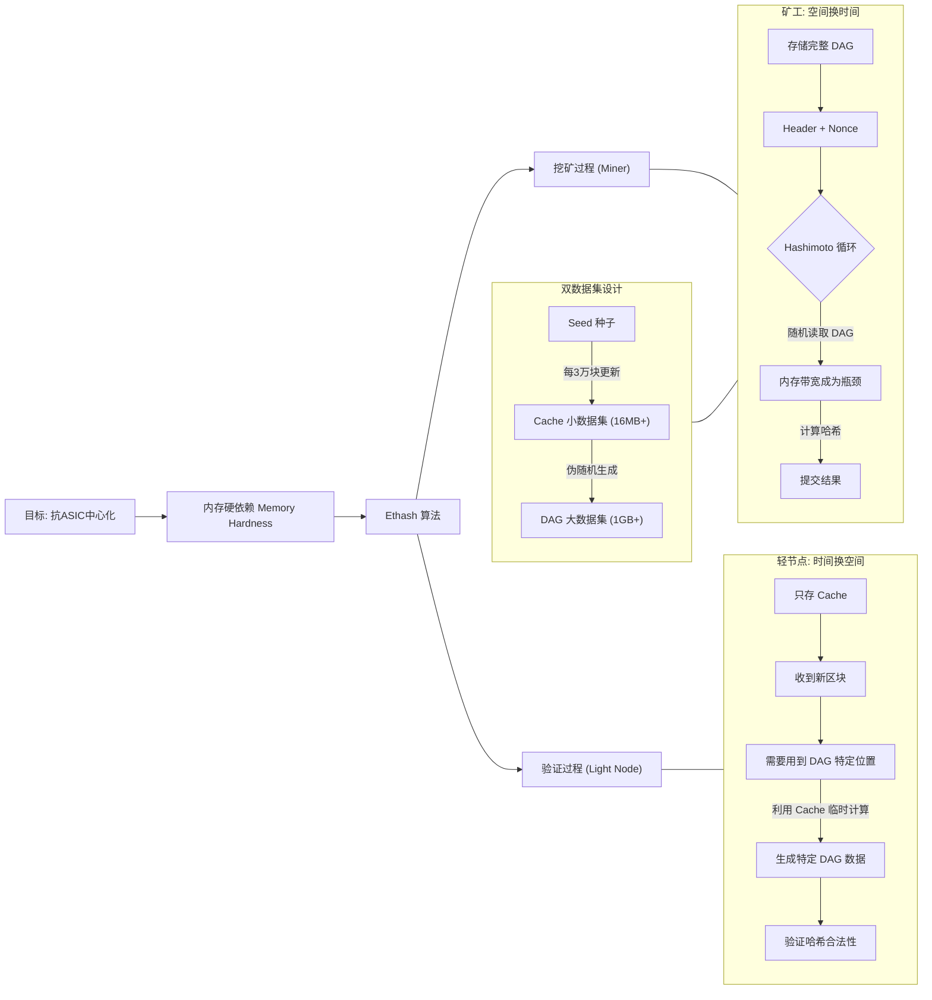
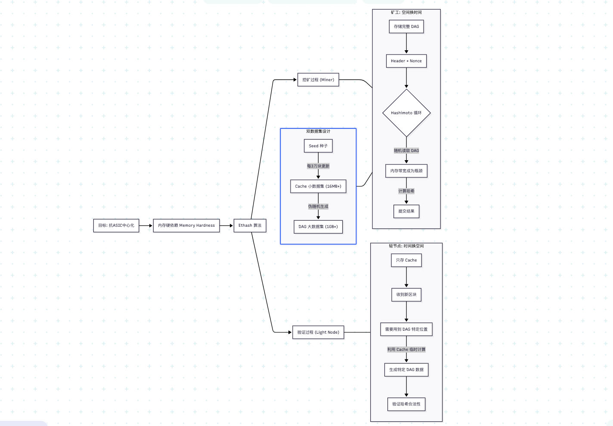

北京大学肖臻老师《区块链技术与应用》公开课第 19 讲的主题是**“以太坊的挖矿算法 (Ethash)”**。

以下是第 19 讲的深度总结：

---

### 一、 核心设计哲学：为什么不一样？

肖老师首先抛出了一个问题：**为什么以太坊不直接沿用比特币的 SHA-256 挖矿算法？**

1. **比特币的教训 (ASIC 化)**：
* SHA-256 是**计算密集型 (CPU-bound)** 的。这意味着谁的运算速度快，谁就挖得快。
* 发展路径：CPU  GPU  FPGA  **ASIC (专用矿机)**。
* **后果**：ASIC 矿机的出现导致算力高度集中在少数大矿场手中，普通人无法参与，违背了“去中心化”的初衷。

2. **以太坊的目标 (ASIC Resistance)**：
* 为了抗 ASIC，以太坊采用了 **内存硬依赖 (Memory Hardness)** 的设计思路。
* **原理**：限制挖矿速度的瓶颈不再是芯片的计算速度，而是**内存的读取带宽**。因为提升内存带宽在硬件物理上很难（比提升 CPU 频率难得多），ASIC 即使做出来，优势也不会像比特币矿机那么夸张。
* **结果**：这使得以太坊在很长一段时间内都是**显卡 (GPU)** 挖矿的主力，保证了算力的分散。

---

### 二、 Ethash 算法详解 (核心机制)

Ethash 是早期 **Dagger** 和 **Hashimoto** 两个算法的结合变体。它的核心在于使用了两个大小悬殊的数据集：**Cache** 和 **DAG**。

#### 1. 两个数据集

* **Cache (小数据集)**：
* **大小**：初始约 **16MB**。
* **生成**：由一个种子 (Seed) 生成。Seed 每隔 30,000 个区块（一个 Epoch，约 5 天）改变一次。
* **特点**：非常小，全节点和轻节点都能轻松存下。
* **对应你的截图**：`mkcache` 函数的代码。

* **DAG / Dataset (大数据集)**：
* **大小**：初始约 **1GB**，每年线性增长（目前已超过 5GB）。
* **生成**：**完全由 Cache 生成**。通过伪随机的方式，从 Cache 中读取数据并混合而成。
* **特点**：非常大，必须存放在**显存**中。

#### 2. 挖矿流程 (Hashimoto 算法)

这是矿工每秒钟进行几百万次的实际工作：

1. **读取输入**：获取区块头 (Header) 和一个随机数 (Nonce)。
2. **计算索引**：用 SHA-3 计算出一个初始哈希，映射到 DAG 中的某个位置。
3. **循环读取 (关键步骤)**：
* 进入 64 次循环。
* 根据当前的哈希值，去 **DAG (1GB+)** 中读取相邻的 128 字节数据。
* 将读取的数据与当前的哈希值进行混合运算。

4. **比较结果**：最后算出一个最终哈希，判断是否小于目标值 (Target)。

**为什么抗 ASIC？**
因为 DAG 太大了，塞不进芯片的 L1/L2 缓存，必须放在显存里。这 64 次循环中的每一次读取都是**随机访问**。矿工的算力实际上被**显存带宽**给卡住了——芯片计算得再快也没用，因为必须等数据从显存里读出来。

---

### 三、 绝妙的设计：轻节点如何验证？

如果挖矿需要 1GB+ 的内存，那手机上的轻节点岂不是没法验证交易了？Ethash 设计了一个“时间换空间”的策略：

* **矿工 (Miner)**：
* **策略**：**空间换时间**。
* **做法**：预先算出完整的 DAG (1GB+) 存在显存里。挖矿时直接读取，速度极快。

* **轻节点 (Light Node)**：
* **策略**：**时间换空间**。
* **做法**：只保存 **16MB 的 Cache**。当需要验证某个区块是否合法时，轻节点不需要整个 DAG。它根据哈希值算出“我需要用到 DAG 里的哪一个数据块”，然后利用 Cache **临时计算**出那一个数据块。
* **代价**：计算一次哈希的时间比矿工慢很多（因为要临时算 DAG 数据），但验证只需要做一次，几毫秒就能完成，完全可接受。

---

### 四、 其他课程重点

1. **Pre-Mining (预挖矿)**：
* 视频最后提到了以太坊启动时，有约 7200 万个 ETH 是通过“预售”发行的，而不是挖出来的。这是为了筹集开发资金。肖老师指出，这在当时引发了争议，但现在已成为一种常见的融资模式 (ICO 的雏形)。

2. **DAG 的增长**：
* DAG 的大小随着区块高度增加而增加。当 DAG 超过 4GB 时，所有 4GB 显存的显卡就瞬间被淘汰了（无法加载 DAG 文件），这被称为“DAG 时代终结”。

---

### 🧠 课程逻辑思维导图 (Ethash)

我将这节课的逻辑整理成了 Mermaid 思维导图：

### 💡 总结

第 19 讲的核心在于理解 **Ethash 的不对称性**：

* **对挖矿者**：必须拥有大内存（存 DAG）和高带宽，迫使算力停留在通用硬件（GPU）上。
* **对验证者**：只需极小内存（存 Cache），保证了轻节点（手机/个人电脑）也能参与网络安全验证。