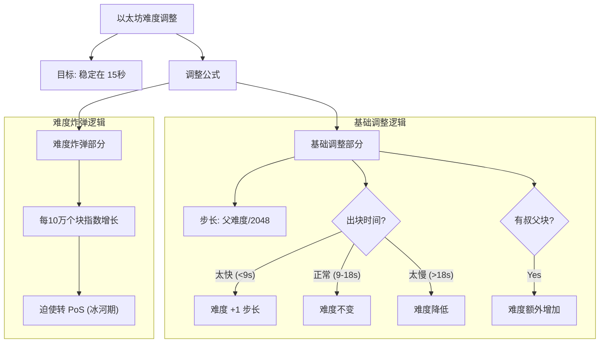
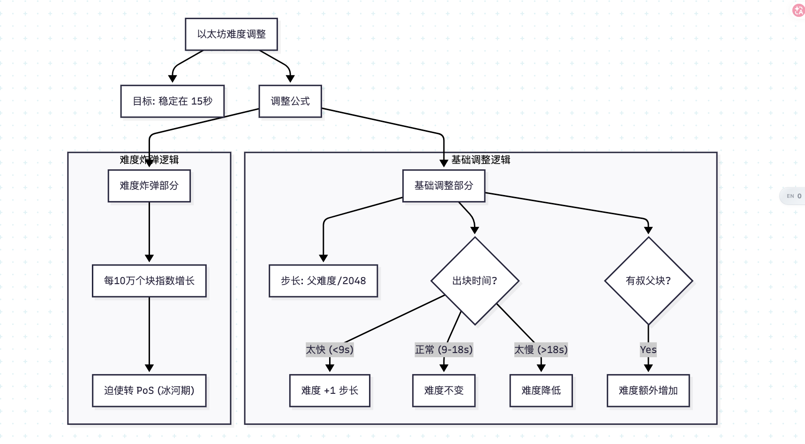

先上课件，难度调整公式

北京大学肖臻老师《区块链技术与应用》公开课第 20 讲的主题是**“以太坊的难度调整” (Difficulty Adjustment in Ethereum)**。

这一讲非常硬核，肖老师详细拆解了以太坊独特的难度调整公式，解释了它是如何通过逐块调整（block-by-block）将出块时间稳定在 15 秒左右的，并介绍了著名的“难度炸弹”机制。

以下是本课内容的**结构化详细总结**：

### 一、 难度调整的目标

与比特币类似，以太坊也需要根据全网算力的变化动态调整挖矿难度。

* **目标出块时间**：以太坊的目标是将出块时间维持在 **15 秒** 左右（相比比特币的 10 分钟极其短暂）。
* **调整频率**：**每个区块**都调整一次（比特币是每 2016 个区块调整一次）。这使得以太坊能更迅速地应对算力波动。

### 二、 难度调整公式详解

以太坊的难度计算公式经历过几个版本的迭代（如 Homestead, Byzantium, Constantinople 等），肖老师课件中主要讲解的是**Byzantium（拜占庭）版本**之后的通用逻辑。

公式核心结构如下（简化表达）：

其中：

* ：当前区块难度
* ：父区块难度 (Parent Difficulty)

#### 1. 基础调整项 (Basic Adjustment)

这是为了维持 15 秒出块的核心逻辑：

* ****：表示调整的**步长**。每次调整的幅度大约是父区块难度的 1/2048。
* ****：当前区块时间戳减去父区块时间戳，即**实际出块时间**。
* ** (Uncle Factor)**：
* 如果当前区块**包含了叔父块**，则 。
* 如果**不包含叔父块**，则 。
* **逻辑**：包含叔父块意味着系统发出了额外的货币（叔块奖励）。为了保持货币发行率稳定，协议需要稍微提高一点难度来抵消这部分“注水”。

* ****：
* 这是用来衡量出块时间相对于目标（约 9~18秒）的偏离程度。
* **如果出块很快 (< 9s)**：，此时 。难度**增加**一个步长。
* **如果出块正常 (9s - 18s)**：结果为 1，此时 。难度**不变**。
* **如果出块很慢 (> 18s)**：结果 > 1，此时  变成负数。难度**降低**。

* ** (下限)**：规定单次难度降低的最大幅度不能超过 99 个步长，主要是为了防止黑客攻击或特殊情况导致难度瞬间崩盘。

#### 2. 难度炸弹 (Difficulty Bomb)

公式的最后一部分是一个指数增长项：

* **定义**：随着区块高度增加，这部分难度会呈**指数级爆炸式增长**。
* **目的**：**“逼宫”**。以太坊计划最终从 PoW（工作量证明）转型为 PoS（权益证明）。为了防止矿工赖在旧的 PoW 链上不走，开发团队设计了这个炸弹。
* **效果**：当炸弹爆发时，挖矿难度会高到几乎挖不出块（“冰河期” Ice Age），强迫所有人升级到 PoS。
* **现实情况**：由于 PoS 开发进度延误，以太坊在历史上多次通过硬分叉（如拜占庭、君士坦丁堡升级）**推迟**难度炸弹的爆发时间（即“回滚区块高度计算”）。

### 三、 总结：ETH vs BTC 难度调整

| 特性 | Bitcoin (比特币) | Ethereum (以太坊) |
| --- | --- | --- |
| **调整周期** | 每 2016 区块 (约2周) | **每个区块** (实时微调) |
| **目标时间** | 10 分钟 | **15 秒** (浮动范围 10-20s) |
| **调整算法** | 简单的比率调整 (Target * Actual/Expected) | **复杂的阶梯函数** (步长微调) |
| **特殊机制** | 无 | **难度炸弹** (为转 PoS 做准备) |
| **叔块影响** | 无 | 包含叔块会**增加难度** |

### 🧠 核心逻辑思维导图

### 💡 关键启示

第 20 讲展示了以太坊作为“第二代区块链”在设计上的精细度。
它不仅仅是一个自动化的数学系统（像比特币那样），还人为埋入了**治理工具（难度炸弹）**，体现了以太坊社区对于“技术升级”和“路线图”的强力把控——**代码即法律，但代码里埋了定时炸弹来倒逼法律的修改**。