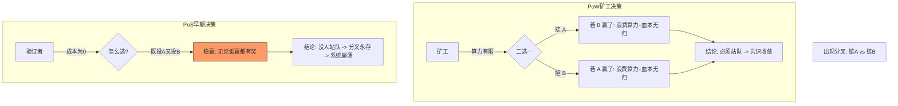
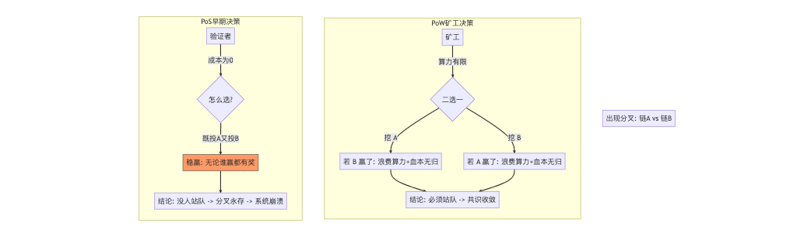

北京大学肖臻老师《区块链技术与应用》公开课第 21 讲的主题是**“权益证明” (Proof of Stake, PoS)**。

在上一讲介绍了以太坊为了转型 PoS 而埋下的“难度炸弹”后，这一讲正式探讨了 PoS 的核心概念、设计初衷以及它面临的**最大技术挑战**。

以下是本课内容的**结构化详细总结**：

### 一、 为什么需要权益证明 (Why PoS?)

比特币和以太坊早期使用的 **PoW (工作量证明)** 机制虽然安全，但存在明显的缺陷：

1. **能源浪费**：挖矿消耗了巨大的电力，这些计算除了维护账本外没有其他实际用途。
2. **算力中心化**：ASIC 矿机的出现导致算力掌握在少数专业矿场手中。

**PoS 的愿景**：

* **虚拟挖矿 (Virtual Mining)**：不再需要物理矿机消耗电力去算哈希。
* **权益即算力**：你持有的币越多（权益越大），你的“挖矿”成功率就越高。
* **One Coin, One Vote**：从“一 CPU 一票”转变为“一币一票”。

### 二、 权益证明的基本原理

在 PoS 系统中：

* **资源**：不再比拼算力 (Hash Power)，而是比拼**币龄 (Coin Age)** 或单纯的**币数量**。
* **出块**：系统根据某种算法（通常是随机选择，权重与持币量成正比）选出一个节点来负责打包下一个区块。
* **逻辑**：如果你持有系统大量的代币，你就是系统的“股东”。理论上，你应该希望系统好，不会去破坏它（因为一旦系统崩溃，你手里的币也就归零了）。

---

### 三、 PoS 的核心挑战：无利害关系攻击 (Nothing at Stake)

这是本节课的**重中之重**。肖老师花了大量篇幅解释为什么早期的 PoS 协议是不可行的。

#### 1. PoW 中的分叉选择

在 PoW (比特币) 中，如果出现两条分叉链：

* 矿工只能选择其中一条进行挖矿。
* **代价高昂**：算力是排他的。你把算力投给 A 链，就不能投给 B 链。如果你两边都挖，算力分散，哪边都挖不过别人。
* **结果**：理性的矿工会选择胜算大的那条链（最长链），分叉很快会收敛。

#### 2. PoS 中的 "Nothing at Stake" 问题

在 PoS 中，挖矿不需要算力，只需要**用私钥签名**。

* **场景**：假设出现了两条分叉链 A 和 B。
* **矿工的策略**：
* 理性的矿工会**同时在 A 链和 B 链上打包/投票**。
* **为什么？** 因为“投票”没有成本（不费电）。
* **收益**：
* 如果 A 赢了，我有 A 的奖励。
* 如果 B 赢了，我有 B 的奖励。
* 两边都下注，由于没有成本，这是**稳赚不赔 (Risk-free)** 的策略。

* **后果**：如果所有人都这么做，分叉永远不会消失，网络无法达成共识。

---

### 四、 其他挑战：长程攻击 (Long Range Attack)

除了 Nothing at Stake，PoS 还面临其他问题：

* **早期权益出售**：攻击者可以收购某些很早期的私钥（当时这些币不值钱）。虽然这些私钥现在可能已经没有币了，但在区块链的**早期历史**中，它们拥有巨大的权重。
* **重写历史**：攻击者利用这些早期私钥，从创世区块附近开始分叉，造出一条比现有主链还要长的链。
* **PoW 的防御**：PoW 不怕长程攻击，因为重写几年的历史需要天文数字的算力（不可伪造的物理成本）。但在 PoS 中，生成历史区块几乎零成本。

### 五、 混合模型 (Hybrid Models)

为了解决上述问题，早期的加密货币尝试了**PoW + PoS 混合**的模式（如 Peercoin 点点币）。

* 主要利用 PoW 挖矿产出区块。
* 利用 PoS 投票来确定链的合法性，防止分叉。
* 但这种方式并没有完全解决能源浪费问题。

---

### 🧠 核心逻辑思维导图 (Nothing at Stake)

为了让你直观理解为什么 PoS 早期版本会失败，我整理了这个博弈论视角的流程图：

### 💡 总结

第 21 讲的核心在于**“批判”**。
肖老师指出，虽然 PoS 看起来很美好（省电），但在设计上比 PoW 难得多。
核心矛盾在于：**物理算力的“排他性”和“昂贵成本”天然地保护了 PoW 的共识收敛；而 PoS 失去了这个物理锚点，必须引入极其复杂的惩罚机制（如以太坊后来引入的“罚没/Slashing”）才能解决 "Nothing at Stake" 问题。**

这就引出了下一讲的内容：以太坊的 PoS 协议 —— **Casper** 是如何通过奖惩机制解决这个问题的。