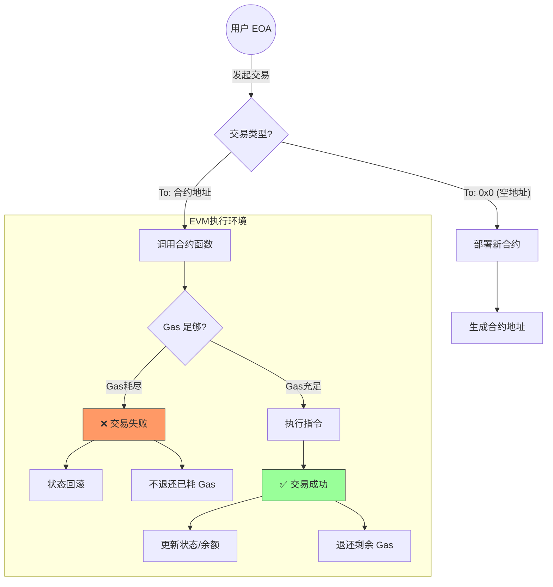

**第 22 讲的主题确实是“智能合约” (Smart Contract)**。

上一讲（P21）主要涵盖了权益证明（PoS）及 Casper 的概念，而从第 22 讲开始，课程正式进入了以太坊的应用核心——智能合约的编程与运行机制。

以下是更正后的\*\*第 22 讲“智能合约”\*\*的详细内容总结：

***

### 一、 什么是智能合约？ (What is a Smart Contract?)

1.  **定义**：

*   智能合约是运行在区块链上的**计算机程序**。
*   它的本质是\*\*“代码即法律” (Code is Law)\*\*。一旦部署在区块链上，它就会严格按照代码逻辑执行，无法被篡改，也不受人为干预。

2.  **以太坊的地位**：

*   如果说比特币是“全球账本”，那么以太坊就是\*\*“全球计算机”\*\*。
*   智能合约就是这台计算机上运行的软件。

### 二、 智能合约的账户模型

在以太坊中，智能合约是一个特殊的**账户**（合约账户），它与普通用户的账户（外部账户 EOA）有区别：

*   **外部账户 (EOA)**：由**私钥**控制，有余额，**无代码**。

*   *用户通过私钥签名发起交易。*

*   **合约账户 (Contract Account)**：由**代码**控制，有余额，**有代码**，有**存储状态 (Storage)**。

*   *合约无法自己发起交易，必须由 EOA 或其他合约调用它才能运行。*

### 三、 智能合约的创建与运行

肖老师详细讲解了合约的生命周期：

#### 1. 创建合约 (Creation)

*   **如何发布？** 用户（EOA）发起一笔特殊的交易。
*   **接收地址**：这笔交易的接收地址（To）是**空的 (0x0)**。
*   **数据域 (Data)**：包含了智能合约编译后的**字节码 (Bytecode)**。
*   **结果**：节点收到这笔交易后，会自动在区块链上生成一个新的合约地址，并将代码部署上去。

#### 2. 调用合约 (Call)

*   **如何执行？** 用户向合约地址发起一笔交易。
*   **数据域 (Data)**：指定了要调用的**函数名**（通过函数签名的哈希）以及**参数**。
*   **Fallback 函数**：如果调用的函数不存在，或者转账时没有带数据，合约会执行默认的 `fallback()` 函数（通常用于接收转账）。

### 四、 汽油费机制 (Gas Mechanism)

这是本节课的核心难点，解释了“为什么要收手续费”以及“怎么收”。

#### 1. 为什么需要 Gas？ (Halting Problem)

*   以太坊是**图灵完备 (Turing Complete)** 的，这意味着它可以写循环语句（`while`, `for`）。
*   **停机问题**：如果有人写了一个死循环（`while(true)`），矿工去执行就会永远卡死，导致全网瘫痪。
*   **解决方案**：引入 Gas。执行每一条指令都要消耗 Gas。如果 Gas 耗尽了，程序强制停止。这使得死循环攻击变得昂贵且不可持续。

#### 2. 计费规则

*   **Gas Limit (汽油限制)**：

*   **含义**：用户在这个交易中**最多愿意支付**多少 Gas。

*   **作用**：保护用户。防止因为程序 Bug 或死循环导致余额被扣光。

*   **Gas Used (实际消耗)**：

*   **含义**：交易实际执行过程中消耗的 Gas 量。

*   **结算**：

*   如果 `Gas Used <= Gas Limit`：交易成功，多余的 Gas 退还给用户。

*   如果 `Gas Used > Gas Limit`：交易失败（Out of Gas），状态回滚，但**Gas 不退**（因为矿工已经付出了计算成本）。

*   **Gas Price (汽油单价)**：

*   **含义**：用户愿意为每单位 Gas 支付多少 ETH。

*   **作用**：决定交易的优先级。给的单价越高，矿工越优先打包。

### 五、 错误处理机制 (Error Handling)

智能合约的执行具有**原子性 (Atomicity)**。

*   **All or Nothing**：一笔交易中的所有操作，要么全部成功，要么全部失败。
*   **回滚 (Rollback)**：
*   如果在执行过程中出现异常（如 `throw`, `revert`，或 Gas 不足），整个交易会被撤销。
*   **状态回滚**：之前修改的变量、转出去的钱，全部恢复原状。
*   **Gas 消耗**：虽然状态回滚了，但执行到报错位置之前所消耗的 Gas 依然要扣除（防止恶意攻击者免费浪费矿工算力）。

### 六、 智能合约的特性与局限

1.  **不可篡改**：合约一旦部署，代码就无法修改。如果发现 Bug，通常只能废弃旧合约，部署新合约（并迁移数据），这使得升级非常麻烦。
2.  **公开透明**：合约的代码（字节码）和所有状态变量在区块链上都是公开可见的。**不要在智能合约里存放密码或隐私数据！**

***

### 🧠 核心逻辑思维导图 (Smart Contract Execution)

### 💡 总结

第 22 讲标志着我们从“底层协议”走向了“应用开发”。
肖老师强调：**智能合约不仅是技术，更是经济模型。** Gas 机制的设计不仅是为了防止死循环，更是为了调节网络资源的市场供需。理解 Gas（Limit vs Price）是开发以太坊应用的基础。
以下是一些上课的课件

