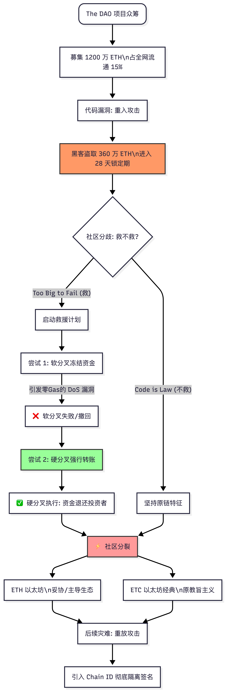

北京大学肖臻老师《区块链技术与应用》公开课第 23 讲的主题是区块链历史上最著名的安全与治理危机—— **“The DAO 事件” (The DAO Attack & Ethereum Hard Fork)** 。

以下是本课内容的**结构化详细总结**：

### 一、 什么是 The DAO？ (背景)

1.  **DAO 的概念**：Decentralized Autonomous Organization（去中心化自治组织）。它没有 CEO，没有董事会，一切决策和资金运转都通过区块链上的智能合约自动执行。

1.  **The DAO 项目**：

    -   它是以太坊早期的一个**众筹投资基金**项目。
    -   参与者将 ETH 投入该智能合约，换取 DAO 代币（代表投票权和收益权）。
    -   项目极其火爆，短短 28 天内募集了超过 1200 万个 ETH（当时占以太坊总流通量的 15% 左右，价值约 1.5 亿美元）。
    -   **风险埋伏**：资金过于集中，且智能合约代码极其复杂，未经充分的安全审计。

### 二、 灾难降临：重入攻击 (The Hack)

-   **漏洞触发**：黑客发现了 The DAO 智能合约中 `splitDAO` 函数（用于让投资者退出并取回 ETH 的函数）存在**重入漏洞 (Reentrancy Vulnerability)** 。
-   **攻击过程**：黑客利用我们上一讲提到的“先转账、后扣款”的顺序错误，通过恶意合约的 `fallback` 函数反复递归调用退款函数。
-   **损失惨重**：黑客在短短几天内，吸走了约 360 万个 ETH（约合 5000 万美元）。
-   **缓冲期**：万幸的是，根据 The DAO 的代码规则，退出的资金会被锁定在一个“子 DAO”中，**28 天内无法提现**。这给了以太坊社区宝贵的应对时间。

### 三、 艰难的抉择：如何拯救？ (The Rescue Plan)

面对巨额损失，以太坊社区面临着史无前例的哲学与技术双重考验。

#### 1. 哲学分歧：救还是不救？

-   **不救 (Code is Law)** ：智能合约的精髓就是不可篡改。既然代码有漏洞，投资者就该为自己的盲目买单。如果官方出面干预，以太坊就变成了中心化机构，失去了信用。
-   **救 (Too Big to Fail)** ：The DAO 绑架了以太坊 15% 的流通量，如果黑客套现，将对以太坊生态造成毁灭性打击。

最后，社区通过投票决定：**救**。

#### 2. 第一次尝试：软分叉 (Soft Fork) - 宣告失败

-   **方案**：矿工通过升级软件，将所有与黑客账户相关的交易标记为非法，拒绝打包。这样黑客的钱就被永久“冻结”了。

-   **致命漏洞 (DoS 攻击风险)** ：

    -   软分叉推出后，安全专家发现了一个致命的系统级漏洞。
    -   矿工在打包交易时，需要先执行代码来判断这笔交易是否与黑客账户有关。如果有关，就拒绝打包。
    -   **问题来了**：因为交易最终被拒绝了（没上链），所以矿工**收不到任何 Gas 费**，但矿工却**白白消耗了算力**去执行检查。
    -   黑客可以疯狂发送大量涉及该账户的垃圾交易，让全网矿工瘫痪（无成本 DDoS 攻击）。

-   **结果**：软分叉方案被紧急撤回。

#### 3. 第二次尝试：硬分叉 (Hard Fork) - 强行修改账本

-   **方案**：V神（Vitalik）和以太坊核心团队决定，在特定的区块高度（Block 1920000）进行硬分叉。
-   **简单粗暴的操作**：在这个区块中，硬编码一段逻辑，将 The DAO 黑客账户里的资金，**强行转移**到一个新的“退款智能合约”中。投资者可以凭 DAO 代币按照 1:100 的原始比例换回 ETH。
-   **结果**：硬分叉成功，大部分矿工和用户升级了节点，受害者拿回了资金。

### 四、 分裂与余波：ETH vs ETC (The Aftermath)

硬分叉虽然挽回了损失，但破坏了“不可篡改”的共识。

1.  **两条链的诞生**：

    -   约 85% 的算力支持了硬分叉，形成了今天的 **以太坊 (ETH)** 。
    -   约 15% 的算力拒绝妥协，坚持原始的不可篡改链，形成了 **以太坊经典 (Ethereum Classic, ETC)** 。黑客偷走的钱在 ETC 链上依然合法保留。

1.  **重放攻击 (Replay Attack)** ：

    -   由于 ETH 和 ETC 在分叉前拥有相同的历史、相同的账户和私钥，它们起初连网络协议都一样。
    -   **乱象**：如果你在 ETH 链上给别人转了 10 个 ETH，有人把这笔交易的广播数据拿到 ETC 链上去广播，你的 ETC 也会被转走（因为签名在两条链上都合法）。交易所因此损失惨重。
    -   **解决**：后来以太坊引入了 **Chain ID (链标识符，EIP-155)** ，在签名时加入链的专属 ID，才彻底隔离了两条链的交易。

* * *

### 🧠 核心逻辑思维导图 (The DAO 危机复盘)

代码段

```
flowchart TD
    Start(The DAO 项目众筹) --> Success[募集 1200 万 ETH\n占全网流通 15%]
    
    Success --> Vulnerability[代码漏洞: 重入攻击]
    Vulnerability --> Hack[黑客盗取 360 万 ETH\n进入 28 天锁定期]
    
    Hack --> Dilemma{社区分歧: 救不救?}
    
    Dilemma -- "Code is Law (不救)" --> Classic[坚持原链特征]
    Dilemma -- "Too Big to Fail (救)" --> Rescue[启动救援计划]
    
    Rescue --> PlanA[尝试 1: 软分叉冻结资金]
    PlanA -- "引发零Gas的 DoS 漏洞" --> FailA[❌ 软分叉失败/撤回]
    
    FailA --> PlanB[尝试 2: 硬分叉强行转账]
    PlanB --> SuccessB[✅ 硬分叉执行: 资金退还投资者]
    
    SuccessB & Classic --> Split[⚡ 社区分裂]
    
    Split --> Chain1[ETH 以太坊\n妥协/主导生态]
    Split --> Chain2[ETC 以太坊经典\n原教旨主义]
    
    Chain1 & Chain2 --> Replay[后续灾难: 重放攻击]
    Replay --> Fix[引入 Chain ID 彻底隔离签名]
    
    style Hack fill:#f96,stroke:#333
    style PlanB fill:#9f9,stroke:#333
    style Split fill:#ff9999,stroke:#333
```



### 💡 总结

第 23 讲是一堂极其生动的**区块链治理课**。

The DAO 事件证明了智能合约的安全性有多么脆弱，也打破了人们对“代码即法律”的盲目迷信。当机器的冷酷逻辑与人类社会的整体利益发生巨大冲突时，以太坊选择了“人为干预”（硬分叉），这成为了区块链历史上最具争议、也最具标志性的分水岭事件。