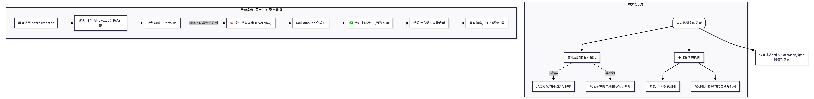

北京大学肖臻老师公开课的 **第 24 讲** 主题是**“以太坊引发的思考” (Reflections on Ethereum)**，并且深入剖析了另一个极其经典的智能合约安全惨案——**美链 (BEC) 溢出漏洞**。

在经历了 The DAO 的洗礼后，这一讲是对整个以太坊生态和智能合约本质的**深度哲学与技术反思**。

以下是第 24，25讲的详细结构化总结与思维导图：

### 一、 智能合约真的“智能”吗？ (Is it Smart? Is it a Contract?)

肖老师开篇提出了一个核心的灵魂拷问：“智能合约”这个名字其实非常有误导性。

1.  **它不是“合约” (Not a Contract)** ：

    -   现实世界中的法律合约通常具有**灵活性**和**模糊性**，遇到纠纷可以由法官根据“精神实质”来裁决。
    -   智能合约只是**冰冷的代码**。它没有常识，不懂人情，哪怕代码明显违背了开发者的初衷（比如被黑客利用），以太坊虚拟机 (EVM) 也会毫不留情地执行。

1.  **它并不“智能” (Not Smart)** ：

    -   人工智能 (AI) 可以在一定程度上应对未知情况。但智能合约完全是**确定性的 (Deterministic)** 的规则引擎，只能严格按照既定指令运行。它其实应该叫“自动执行脚本”。

### 二、 不可篡改性的“双刃剑” (The Double-edged Sword of Immutability)

在区块链世界，“代码即法律” (Code is Law) 和“不可篡改”曾被视为最高准则。但在软件工程领域，这是违背常理的。

-   **软件工程常识**：任何复杂的软件都有 Bug。有了 Bug 就需要打补丁 (Patch)。
-   **以太坊的困境**：智能合约一旦部署，代码就**永远无法修改**。
-   **妥协方案**：目前开发者只能被迫使用一些非常复杂的绕过机制，比如部署一个“代理合约 (Proxy Contract)”，让它指向新的逻辑合约地址。但这增加了系统的复杂性和被攻击的切入点。

### 三、 经典安全惨案：美链 (BEC) 整型溢出漏洞

如果说 The DAO 事件是因为逻辑复杂导致的“重入攻击”，那么 **美链 (Beauty Chain, 简称 BEC)** 事件则是因为极其低级的数学错误导致的“毁灭性打击”。

#### 1. 什么是整型溢出 (Integer Overflow)?

-   智能合约变量类型通常是 `uint256`（无符号 256 位整数）。它的最大值是 $2^{256} - 1$。
-   如果你给最大值再加 1，它不会报错，而是会**像汽车里程表一样“归零”** （变成 0）。同样，0 减去 1 也会变成最大值（下溢出）。

#### 2. BEC 合约的致命漏洞

BEC 的代码中有一个批量转账函数 `batchTransfer(address[] _receivers, uint256 _value)`。

它的错误逻辑如下：

-   **计算总额**：`uint256 amount = uint256(cnt) * _value;` （`cnt` 是收款人的数量，`_value` 是每个人分多少钱）。
-   **检查余额**：`require(_value > 0 && balances[msg.sender] >= amount);` （检查发起人的余额够不够支付总额）。

#### 3. 黑客的攻击手法

-   黑客传入了 **2 个收款地址** (`cnt = 2`)。
-   黑客传入的 `_value` 是一半的极限最大值（比如 $2^{255}$）。
-   **灾难发生**：`amount = 2 * 2^{255} = 2^{256}`。由于溢出，`amount` 瞬间**变成了 0**。
-   **绕过检查**：此时，黑客无论自己账上有多少钱，都能通过余额检查，因为 `amount` 算出来是 0！
-   **凭空印钞**：随后代码给那 2 个收款地址各加了天文数字的 BEC 代币。
-   **结果**：黑客拿着海量代币去交易所抛售，BEC 代币瞬间暴跌归零，整个项目宣告死亡。

### 四、 总结：去中心化与人类治理的博弈

-   **Solidity 语言的缺陷**：早期的 Solidity 设计得非常不严谨，连防止溢出的基础保护都没有（后来开发者被迫使用 SafeMath 库，直到 Solidity 0.8.0 版本才原生内置了溢出检查）。
-   **人的介入不可避免**：无论是 The DAO 的硬分叉，还是 BEC 的直接归零，都证明了完全的“去中心化自治”目前只是一种乌托邦。当代码严重崩溃时，最终拯救或抛弃它的，依然是人类社会的共识。

* * *

### 🧠 核心逻辑思维导图 (BEC 溢出攻击与以太坊反思)

代码段

```
flowchart TD
    subgraph 以太坊反思
    Reflection("以太坊引发的思考") --> Misnomer["智能合约的名不副实"]
    Misnomer -.->|"不智能"| NoAI["只是死板的自动执行脚本"]
    Misnomer -.->|"非合约"| NoLaw["缺乏法律的灵活性与常识判断"]
    
    Reflection --> DoubleEdge["不可篡改的代价"]
    DoubleEdge --> BugFixing["修复 Bug 极度困难"]
    DoubleEdge --> Proxy["被迫引入复杂的代理合约机制"]
    end

    subgraph 经典案例: 美链 BEC 溢出漏洞
    BEC_Start["黑客调用 batchTransfer"] --> Inputs["传入: 2个地址, value为极大的数"]
    
    Inputs --> MathCalc["计算总额: 2 * value"]
    MathCalc -->|"uint256 最大值限制"| Overflow["💥 发生整型溢出 (Overflow)"]
    
    Overflow --> AmountZero["总额 amount 变成 0"]
    AmountZero --> CheckPass["✅ 绕过余额检查 (因为 > 0)"]
    
    CheckPass --> InfiniteMoney["给收款方增加海量代币"]
    InfiniteMoney --> Crash["黑客抛售，BEC 瞬间归零"]
    end

    Reflection --> Solution["语言演进: 引入 SafeMath/编译器级别防御"]
```



### 💡 核心启示

第 24 讲是全套课程中非常具有**现实教育意义**的一课。它告诉所有区块链开发者：在传统 Web 领域，“敏捷开发、快速迭代”是金科玉律；但在区块链智能合约领域， **“慢即是快，安全第一”** 才是生存法则。写在链上的每一行代码，都有可能成为动辄千万美元的提款机。

