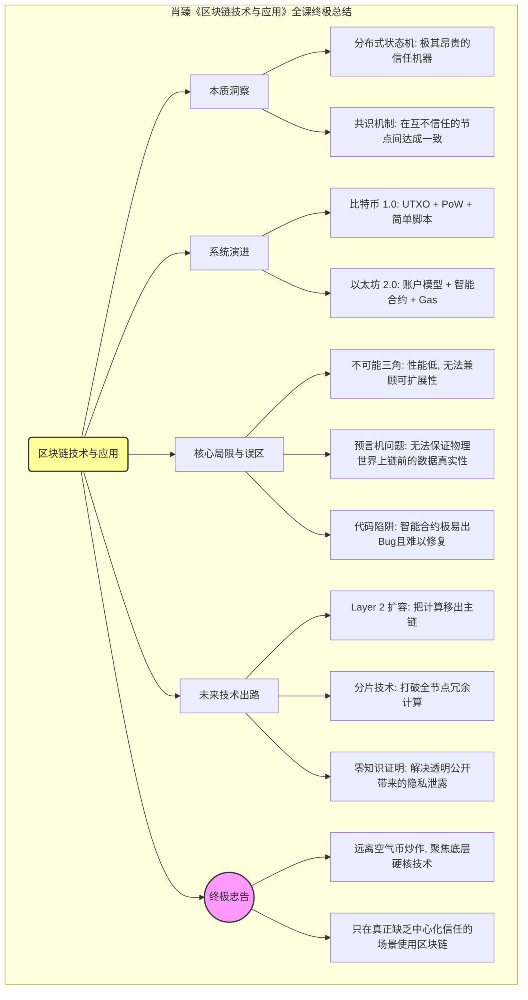
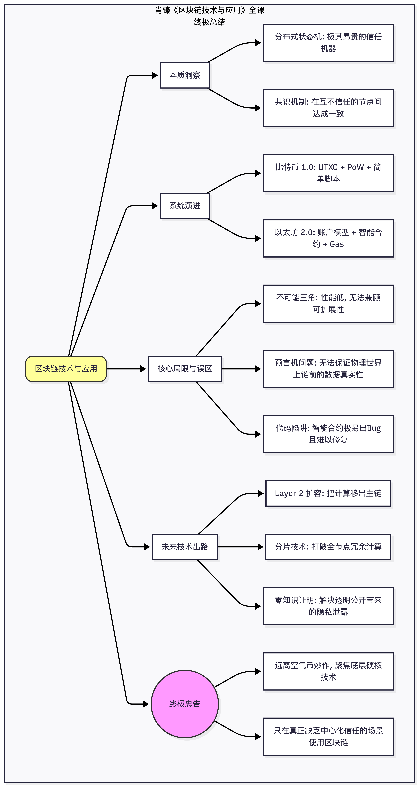

太棒了！恭喜你坚持到了最后一讲！

北京大学肖臻老师《区块链技术与应用》公开课的 **第 26 讲** 是全套课程的**“终极总结与展望” (Conclusion & Future Outlook)**。

在详细拆解了比特币和以太坊的底层硬核技术、共识机制和安全惨案后，肖老师在这一讲拔高了视角，抛开具体的代码细节，对整个区块链行业的**本质、瓶颈、认知误区以及未来发展**做了一次极其透彻的哲学与技术总结。

以下是第 26 讲（也是整门课程大结局）的**结构化详细总结**：

### 一、 区块链的本质究竟是什么？

在经历了长达 25 讲的学习后，我们需要回归本源：

1. **去中心化的状态机 (Decentralized State Machine)**：
* 区块链的本质就是一个全球共享的、只能追加（Append-only）的分布式状态机。
* 所有的交易、智能合约的运行，本质上都是在推动这个系统从“当前状态”安全地转移到“下一个状态”。

2. **极其昂贵的“信任机器”**：
* 为了实现“去中心化”和“免信任 (Trustless)”，区块链付出了极其惨痛的性能代价。
* 全网成千上万个全节点，都在做着**完全相同的冗余计算**。因此，不要指望把区块链当作一个“高效的云数据库”来用。**区块链是用极高的效率代价，换取了极致的安全性与公开透明。**

### 二、 两代区块链的演进对比 (BTC vs ETH)

肖老师对课程的两大核心系统进行了终极对比：

* **比特币 (区块链 1.0)**：
* **定位**：全球数字加密货币 (Global Currency)。
* **模型**：UTXO 模型（极简、并发性好、无状态）。
* **脚本**：非图灵完备（无循环），功能极弱，但安全面积极小。

* **以太坊 (区块链 2.0)**：
* **定位**：世界计算机 (World Computer) 与智能合约平台。
* **模型**：账户模型（Account-based，符合直觉，便于状态管理）。
* **脚本**：图灵完备（EVM，通过 Gas 机制解决死循环问题），能写任意复杂的逻辑，但引入了巨大的安全风险（如重入攻击、溢出漏洞）。

### 三、 刺破泡沫：区块链的真正局限性

在当年 ICO（首次代币发行）疯狂炒作的背景下，肖老师给大家泼了几盆冷水，指出了区块链面临的严峻现实：

#### 1. 性能瓶颈与不可能三角 (Scalability Trilemma)

* 区块链面临着**“去中心化 (Decentralization)”、“安全性 (Security)”和“可扩展性 (Scalability)”**的终极博弈。
* 目前的底层公链（Layer 1）为了绝对的安全和去中心化，每秒只能处理十几笔交易（TPS 极低），远远无法满足现实世界（如 Visa/支付宝）的商业需求。

#### 2. 预言机问题 (The Oracle Problem)

* **链上与链下的鸿沟**：区块链只能保证数据**上链之后**不被篡改，但它**绝对无法保证**数据在输入时的真实性。
* 比如，如果用区块链做农产品溯源，如果工人一开始录入的检测数据就是造假的，区块链只会把这个“假数据”永久、不可篡改地记录下来。这就是所谓的 **“Garbage in, Garbage out” (垃圾进，垃圾出)**。
* 区块链解决不了物理世界的造假问题，它只解决数字世界的共识问题。

#### 3. 智能合约的名不副实

* 再次强调，智能合约不是 AI，不懂人类法律的灵活性，它只是死板的自动执行脚本。
* 所谓的“代码即法律 (Code is Law)”在遇到极其复杂的业务逻辑时，往往会演变成“Bug 即法律”，导致 The DAO 这样的惨剧。

### 四、 未来的技术出路 (Future Solutions)

尽管有诸多局限，但肖老师对技术的未来持乐观态度。针对性能瓶颈，学术界和工业界正在探索：

1. **分片技术 (Sharding)**：将全网节点分组，不再要求每个节点处理所有交易，从而横向扩展 TPS。
2. **Layer 2 (二层网络)**：把大量计算和微小交易放到主链之外（如状态通道、Rollups）执行，只在最终结算或发生纠纷时才向主链（Layer 1）提交数据。

### 五、 肖老师的终极忠告

* **远离炒作，回归技术**：不要被币圈的暴富神话和庞氏骗局（各种传销币、空气币）所迷惑。绝大多数项目都没有实际落地价值。
* **寻找真正的痛点**：区块链技术的真正威力，在于解决**“跨信任主体”**的协作问题。如果一个业务本身就有强大的中心化信用背书（比如央行、阿里），那强行上链只是为了蹭热点，毫无意义。

---

### 🧠 全课终极思维导图 (Grand Finale Mind Map)

### 🎓 结语

历经 26 讲，肖臻老师用他极其严谨、逻辑缜密的学术派风格，为无数人拨开了币圈的狂热迷雾，还原了区块链技术最初的极客之美。

**这不仅仅是一门关于计算机科学的课，更是一门关于密码学、博弈论、分布式系统和人类经济学的综合课。** 至此，所有的课程精华已经全部为你提取完毕！希望这份完整的笔记能成为你探索 Web3 和区块链世界的坚实基石。如果你准备利用这些知识做项目，或者有其他需要探讨的前沿问题（比如现在的 Layer2、zk-Rollups），随时欢迎找我聊天！祝你学习愉快！